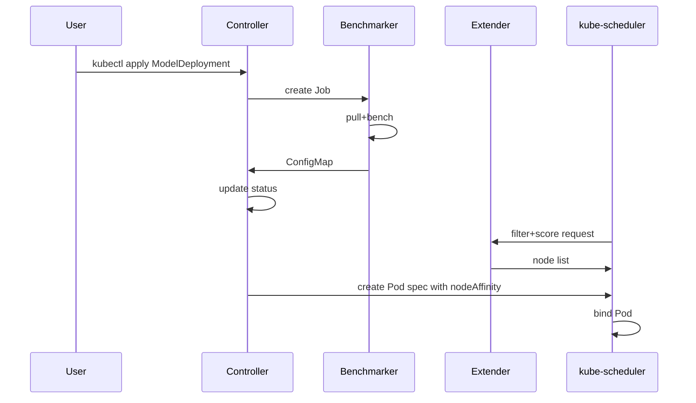

### `AGENTS.md`
# FlexInfer Agents & Runtime Components

FlexInfer is split into **five** cooperating executables (all written in Go).
This document explains what each agent does, how they communicate, and which options you can tune.

| Component | Binary | Runs on | Key responsibility |
|-----------|--------|---------|--------------------|
| Node Agent | `flexinfer-agent` | Every GPU-capable node | Detect hardware & emit labels |
| Benchmarker | `flexinfer-bench` | Job pod (ephemeral) | Measure tokens/s per model-device pair |
| Controller Manager | `flexinfer-manager` | Control-plane | Reconciles `ModelDeployment` CRDs |
| Scheduler Extender | `flexinfer-sched` | Control-plane | Filters & scores nodes during `kubectl scale` / HPA actions |
| Metrics Exporter | built-in | Shared library | Collects Prometheus metrics for all of the above |

---

## 1. Node Agent (`flexinfer-agent`)

### What it detects

| Label | Example | Notes |
|-------|---------|-------|
| `flexinfer.ai/gpu.vendor` | `AMD` / `NVIDIA` | Populated from PCI ID table |
| `flexinfer.ai/gpu.vram` | `24Gi` | MiB rounded down to GiB |
| `flexinfer.ai/gpu.arch` | `gfx90a` / `sm_89` | Exposed by `rocm-smi` / `nvidia-smi` |
| `flexinfer.ai/gpu.int4` | `true` | Capability to run INT4 kernels |
| `flexinfer.ai/cpu.avx512` | `false` | Allows CPU-fallback scoring |

### Config flags

| Flag | Default | Description |
|------|---------|-------------|
| `--interval` | `30s` | How often to re-probe hardware |
| `--metrics-port` | `9100` | Prometheus scrape port |
| `--label-prefix` | `flexinfer.ai/` | Customize if conflicts with other labelers |

---

## 2. Benchmarker (`flexinfer-bench`)

Executed once per `ModelDeployment` × device class:

1. Pulls the model OCI artifact into the node’s shared cache path (`/models` by default).
2. Launches the backend container with a *micro-batch* (128 tokens).
3. Records median tokens/s across 5 runs.
4. Publishes the result to a `ConfigMap` keyed by `model-hash` + `device-class`.

### Tuning knobs

| CRD Field | Purpose |
|-----------|---------|
| `spec.benchmark.warmupIterations` | Override default 2 warm-ups |
| `spec.benchmark.minDuration` | Run until either N seconds or M iterations, whichever first |

---

## 3. Controller Manager (`flexinfer-manager`)

A standard Kubernetes controller built with `controller-runtime`.

* Reconciles desired state → creates underlying backend Deployment + PVC + Service.
* Spawns a Benchmarker Job whenever it sees an unknown model-device pair.
* Updates `.status` with live tokens/s pulled from the Metrics Exporter.

### Environment variables

| Name | Default | Description |
|------|---------|-------------|
| `MODEL_CACHE_PATH` | `/models` | Must match hostPath or Longhorn PVC mount |
| `DEFAULT_BACKEND_IMAGE` | `ghcr.io/flexinfer/ollama:latest` | Image used when `spec.backend` omitted |

---

## 4. Scheduler Extender (`flexinfer-sched`)

Implements both **filter** and **score** phases:

1. **Filter** – Keep only nodes that have labels satisfying the model’s quantization + VRAM requirement.
2. **Score** – Combine (a) benchmarked tokens/s, (b) current GPU utilization, and (c) node cost (if provided via annotation).

> **Scoring formula (v0.1):**
> `score = TPS_normalized × 0.7 - GPU_util × 0.2 - cost × 0.1`

Tune weights with:

```yaml
helm install flexinfer flexinfer/flexinfer \
  --set scheduler.weights.tps=0.8 \
  --set scheduler.weights.util=0.1 \
  --set scheduler.weights.cost=0.1
```


---

## 5. Metrics Exporter

A shared Go module embedded in every binary.

| Metric | Labels | Meaning |
|---|---|---|
| `flexinfer_tokens_per_second` | `model`, `backend`, `node` | Rolling 1-minute average |
| `flexinfer_model_load_seconds` | `model`, `node` | Time to pull model from cache/registry |
| `flexinfer_gpu_temperature_celsius` | `gpu`, `node` | From rocm-smi/nvidia-smi |


⸻

## Sequence diagram (CRD → running pod)




⸻

Advanced topics
* KV-Cache tiering: planned for v0.2—swap key-value cache between GPU HBM and host DDR.
* Harbor model OCI plugin: v0.4—push/pull LLM weights straight from your private registry.
* CNCF Sandbox: target submission once CI/CD passes conformance on Kind, K3s, and MicroK8s.

⸻

Feedback & questions

Open a GitHub Discussion or ping @your-handle on the Llama.cpp Discord (#flexinfer).

Happy hacking! 🚀


