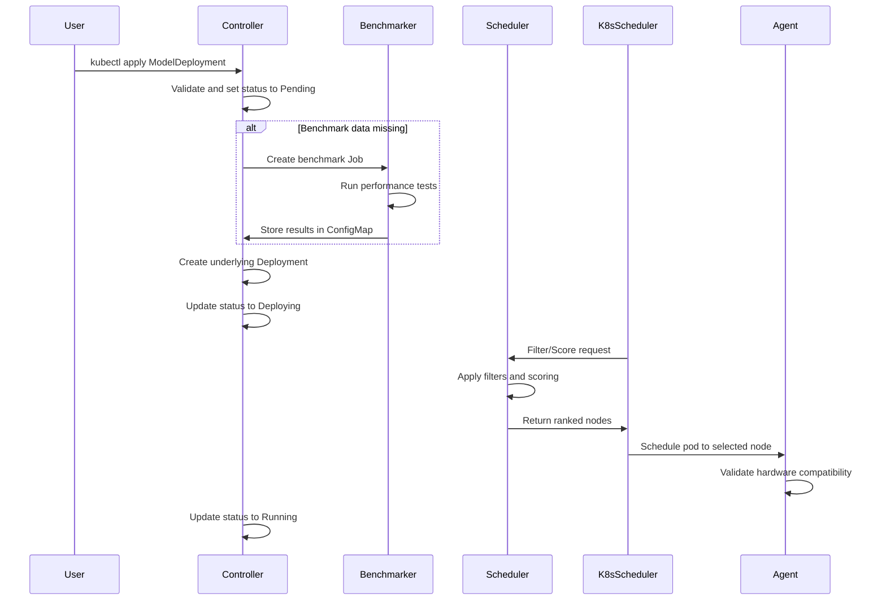

# FlexInfer Agents & Runtime Components

FlexInfer is split into **five** cooperating executables (all written in Go).
This document explains what each agent does, how they communicate, and which options you can tune.

| Component | Binary | Runs on | Key responsibility |
|-----------|--------|---------|--------------------| 
| Node Agent | `flexinfer-agent` | Every GPU-capable node | Detect hardware & emit labels |
| Benchmarker | `flexinfer-bench` | Job pod (ephemeral) | Measure tokens/s per model-device pair |
| Controller Manager | `flexinfer-manager` | Control-plane | Reconciles `ModelDeployment` CRDs |
| Scheduler Extender | `flexinfer-sched` | Control-plane | Filters & scores nodes during scheduling |
| Metrics Exporter | built-in | All components | Collects Prometheus metrics for all of the above |

---

## 1. Node Agent (`flexinfer-agent`)

### What it detects

The node agent performs comprehensive hardware discovery and applies labels to nodes:

| Label | Example | Notes |
|-------|---------|-------|
| `flexinfer.ai/gpu.vendor` | `AMD` / `NVIDIA` | Populated from PCI ID detection |
| `flexinfer.ai/gpu.vram` | `24Gi` | Total VRAM per GPU in GiB |
| `flexinfer.ai/gpu.arch` | `gfx90a` / `sm_89` | GPU architecture identifier |
| `flexinfer.ai/gpu.int4` | `true` | INT4 quantization support capability |
| `flexinfer.ai/gpu.count` | `4` | Number of GPUs detected on the node |
| `flexinfer.ai/cpu.avx512` | `false` | CPU feature detection for fallback |

### Implementation Details

- **Hardware Detection**: Uses system calls and PCI enumeration to identify GPU hardware
- **Label Management**: Automatically applies and updates node labels based on detected capabilities
- **Error Handling**: Robust error handling for hardware detection failures
- **Caching**: Efficient caching of hardware information to reduce system load

### Config flags

| Flag | Default | Description |
|------|---------|-------------|
| `--interval` | `30s` | How often to re-probe hardware |
| `--metrics-port` | `9100` | Prometheus scrape port |
| `--label-prefix` | `flexinfer.ai/` | Customize if conflicts with other labelers |
| `--dry-run` | `false` | Log actions without applying labels |
| `--node-name` | auto-detected | Override node name for labeling |

---

## 2. Benchmarker (`flexinfer-bench`)

### Execution Model

The benchmarker runs as a Kubernetes Job, executed once per unique `ModelDeployment` × device class combination:

1. **Model Acquisition**: Pulls the model artifact into the node's shared cache path
2. **Container Launch**: Starts the specified backend container with configured resources
3. **Performance Testing**: Executes benchmark runs with configurable parameters
4. **Result Storage**: Publishes results to a `ConfigMap` for scheduler consumption

### Implementation Features

- **Mock Benchmarking**: Currently implements simulated performance metrics
- **Extensible Backend**: Designed to support multiple inference backends (Ollama, vLLM, etc.)
- **Resource Management**: Proper cleanup of test resources after completion
- **Error Recovery**: Robust error handling and retry logic

### Configuration Options

Available through the `ModelDeployment` CRD spec:

| CRD Field | Default | Purpose |
|-----------|---------|---------|
| `spec.benchmark.warmupIterations` | `2` | Number of warm-up runs before measurement |
| `spec.benchmark.minDuration` | `30s` | Minimum benchmark duration |
| `spec.benchmark.batchSize` | `128` | Tokens per benchmark batch |
| `spec.benchmark.iterations` | `5` | Number of measurement iterations |

---

## 3. Controller Manager (`flexinfer-manager`)

### Core Functionality

A comprehensive Kubernetes controller built with `controller-runtime` that provides:

- **CRD Reconciliation**: Complete lifecycle management of `ModelDeployment` resources
- **Status Management**: Detailed status tracking with conditions and phases
- **Event Recording**: Comprehensive event logging for debugging and monitoring
- **Finalizer Handling**: Proper cleanup of dependent resources
- **Benchmark Orchestration**: Automatic triggering of benchmarking jobs

### Status Tracking

The controller maintains detailed status information:

```go
type ModelDeploymentStatus struct {
    Phase      ModelDeploymentPhase `json:"phase,omitempty"`
    Conditions []metav1.Condition   `json:"conditions,omitempty"`
    Replicas   int32                `json:"replicas,omitempty"`
    Endpoints  []Endpoint           `json:"endpoints,omitempty"`
}
```

### Supported Phases

| Phase | Description |
|-------|-------------|
| `Pending` | Initial state, awaiting scheduling |
| `Benchmarking` | Performance measurement in progress |
| `Deploying` | Creating underlying Kubernetes resources |
| `Running` | Deployment is active and serving requests |
| `Failed` | Deployment has encountered an error |
| `Terminating` | Cleanup in progress |

### Environment variables

| Name | Default | Description |
|------|---------|-------------|
| `MODEL_CACHE_PATH` | `/models` | Shared model storage location |
| `DEFAULT_BACKEND_IMAGE` | `ghcr.io/flexinfer/ollama:latest` | Default inference backend |
| `BENCHMARK_IMAGE` | `flexinfer/benchmarker:latest` | Benchmarker container image |
| `METRICS_PORT` | `8080` | Controller metrics endpoint |

---

## 4. Scheduler Extender (`flexinfer-sched`)

### Scheduling Algorithm

The scheduler extender implements a sophisticated two-phase approach:

#### Filter Phase
Eliminates nodes that cannot satisfy the workload requirements:
- **GPU Requirements**: Matches requested GPU count and type
- **VRAM Requirements**: Ensures sufficient memory for the model
- **Quantization Support**: Verifies hardware supports requested quantization
- **Architecture Compatibility**: Matches model requirements with GPU architecture

#### Score Phase
Ranks suitable nodes using a weighted scoring algorithm:

```go
score = (TPS_normalized × TPS_weight) - (GPU_util × Util_weight) - (Cost × Cost_weight)
```

### Scoring Factors

| Factor | Weight | Description |
|--------|--------|-------------|
| Tokens/Second | 0.7 | Benchmarked performance for model-device pair |
| GPU Utilization | 0.2 | Current GPU resource usage |
| Node Cost | 0.1 | Cost per hour (from node annotations) |

### Configuration

Scoring weights can be configured via Helm values:

```yaml
scheduler:
  weights:
    tps: 0.8      # Performance weight
    util: 0.1     # Utilization weight  
    cost: 0.1     # Cost weight
  port: 8000      # Extender webhook port
```

### Implementation Details

- **Webhook Server**: HTTP server implementing Kubernetes scheduler extender protocol
- **Concurrent Processing**: Efficient handling of multiple scheduling requests
- **Caching**: Performance data caching for improved response times
- **Fallback Logic**: Graceful degradation when benchmark data is unavailable

---

## 5. Metrics Exporter

### Architecture

The metrics exporter is implemented as a shared Go module embedded in every binary, providing consistent observability across all components.

### Available Metrics

| Metric | Labels | Description |
|--------|--------|-------------|
| `flexinfer_tokens_per_second` | `model`, `backend`, `node` | Model performance metrics |
| `flexinfer_model_load_seconds` | `model`, `node` | Model loading time |
| `flexinfer_gpu_temperature_celsius` | `gpu`, `node` | GPU temperature monitoring |
| `flexinfer_controller_reconciles_total` | `result` | Controller reconciliation count |
| `flexinfer_scheduler_requests_total` | `phase`, `result` | Scheduler extender request count |
| `flexinfer_benchmark_duration_seconds` | `model`, `device_class` | Benchmark execution time |

### Prometheus Configuration

```yaml
scrape_configs:
- job_name: 'flexinfer-agent'
  kubernetes_sd_configs:
  - role: node
  relabel_configs:
  - source_labels: [__meta_kubernetes_node_label_flexinfer_ai_enabled]
    regex: "true"
    action: keep

- job_name: 'flexinfer-controller'
  static_configs:
  - targets: ['flexinfer-controller:8080']

- job_name: 'flexinfer-scheduler'
  static_configs:
  - targets: ['flexinfer-scheduler:8000']
```

---

## Communication Flow


```mermaid
sequenceDiagram
    participant User
    participant Controller
    participant Benchmarker
    participant Scheduler
    participant K8sScheduler
    participant Agent

    User->>Controller: kubectl apply ModelDeployment
    Controller->>Controller: Validate and set status to Pending
    
    alt Benchmark data missing
        Controller->>Benchmarker: Create benchmark Job
        Benchmarker->>Benchmarker: Run performance tests
        Benchmarker->>Controller: Store results in ConfigMap
    end
    
    Controller->>Controller: Create underlying Deployment
    Controller->>Controller: Update status to Deploying
    
    K8sScheduler->>Scheduler: Filter/Score request
    Scheduler->>Scheduler: Apply filters and scoring
    Scheduler->>K8sScheduler: Return ranked nodes
    
    K8sScheduler->>Agent: Schedule pod to selected node
    Agent->>Agent: Validate hardware compatibility
    
    Controller->>Controller: Update status to Running
```

---

## Advanced Features

### Status Conditions

The controller maintains detailed condition information:

- `Available`: Deployment is ready to serve traffic
- `Progressing`: Deployment is being updated
- `ReplicaFailure`: Unable to create desired replicas
- `BenchmarkComplete`: Performance measurement finished
- `NodeSelected`: Scheduling completed successfully

### Event Recording

Comprehensive event logging covers:
- Deployment lifecycle events
- Benchmark execution status
- Scheduling decisions and outcomes
- Error conditions and recovery actions

### Resource Management

- **Finalizers**: Proper cleanup ordering with `flexinfer.ai/finalizer`
- **Owner References**: Garbage collection of dependent resources
- **Resource Quotas**: Integration with Kubernetes resource management

---

## Development and Testing

### Building Components

```bash
# Build all binaries
make build

# Build specific component
make build-agent
make build-controller
make build-scheduler
make build-benchmarker
```

### Testing

```bash
# Run all tests
make test

# Component-specific tests
go test ./agents/agent/...
go test ./controllers/...
go test ./scheduler/...
```

### Local Development

```bash
# Run controller locally
export KUBECONFIG=~/.kube/config
go run cmd/flexinfer-manager/main.go

# Run with debug logging
go run cmd/flexinfer-manager/main.go --log-level=debug
```

---

## Troubleshooting

### Common Issues

1. **Node labels not appearing**: Check agent logs and RBAC permissions
2. **Benchmarks not triggering**: Verify benchmark job creation and ConfigMap access
3. **Scheduling failures**: Check scheduler extender logs and webhook connectivity
4. **Status not updating**: Verify controller reconciliation loops and event recording

### Debug Commands

```bash
# Check node labels
kubectl get nodes --show-labels | grep flexinfer

# View controller logs
kubectl logs -n flexinfer-system deployment/flexinfer-controller

# Check benchmark results
kubectl get configmaps -n flexinfer-system -l app=flexinfer-benchmarks

# View scheduler decisions
kubectl logs -n kube-system deployment/flexinfer-scheduler
```

---

## Future Roadmap

### Phase 2 (Production Ready)
- KV-Cache tiering: GPU HBM to host DDR memory management
- Harbor model OCI plugin: Direct model registry integration
- Advanced monitoring: Detailed performance analytics
- Multi-tenancy: Namespace isolation and resource quotas

### Phase 3 (Enterprise Features)  
- Autoscaling: HPA integration with custom metrics
- Cost optimization: Advanced cost-aware scheduling
- Security: Enhanced RBAC and admission controllers
- Compliance: Audit logging and policy enforcement

---

## Feedback & Support

- **GitHub Issues**: [FlexInfer Issues](https://github.com/flexinfer/flexinfer/issues)
- **Discussions**: [GitHub Discussions](https://github.com/flexinfer/flexinfer/discussions)
- **Discord**: #flexinfer channel on Llama.cpp Discord

Happy hacking! 🚀

## Planning
- See `ROADMAP.md` for project status and plans.