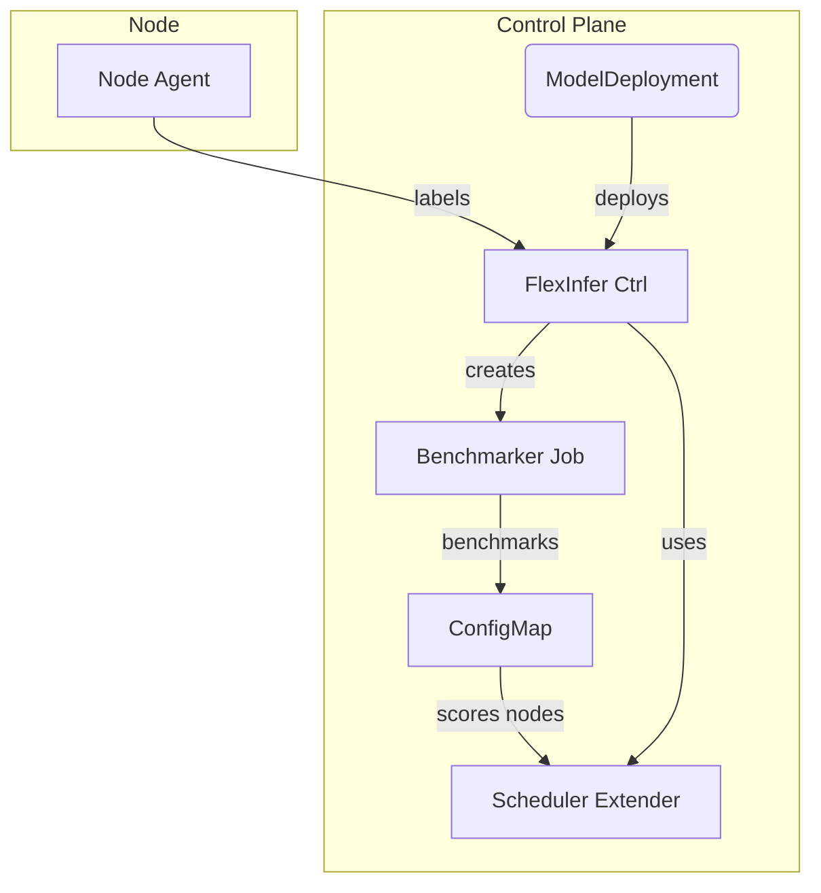

# FlexInfer

> **Kubernetes operator + scheduler plugin that routes LLM inference to the best mix of AMD, NVIDIA, or CPU nodes—automatically.**

[](https://github.com/crb2nu/flexinfer/actions/workflows/ci.yml)
[](LICENSE)

FlexInfer closes the gap between “I have whatever GPUs are lying around” and “I want my models to run fast, cheaply, and with no manual node labels.”
Home-labbers and on-prem teams can declare **one** `ModelDeployment` CRD; FlexInfer discovers the cluster’s capabilities, benchmarks each model once, and schedules pods to the cheapest node that meets their throughput SLO.

---

## ✨ Features

* **Zero-touch GPU discovery** – Detects CUDA, ROCm, VRAM, FP16/INT4, & temperature via a lightweight node agent.
* **Auto-benchmark & caching** – Runs a micro-benchmark per model × device class; stores a shared model cache so disks aren’t littered with duplicates.
* **Throughput-aware scheduling** – A scheduler extender selects nodes based on benchmarked *tokens/s* and live utilization.
* **Plug-in backends** – Works with Ollama, vLLM, TensorRT-LLM (bring-your-own container image).
* **Observability out of the box** – Exposes Prometheus metrics (`tokens_per_second`, `latency_p95`, `gpu_temperature`) and ships a Grafana dashboard.
* **Tiny footprint** – < 20 MB binary, no Istio, no sidecar explosion—perfect for home labs and edge clusters.

---

## 🚀 Quick start (Kind demo)

```bash
# 1. Create a local multi-node cluster (kind + containerd runtime-class support)
kind create cluster --config hack/kind-mixed-gpu.yaml

# 2. Install FlexInfer CRDs & controller
helm repo add flexinfer https://flexinfer.github.io/charts
helm install flexinfer flexinfer/flexinfer --namespace flexinfer-system --create-namespace

# 3. Deploy your first model
kubectl apply -f examples/llama3-8b.yaml

# 4. Watch the pods land on the optimal node
kubectl get pods -l flexinfer.ai/model=llama3-8b -o wide

Note: On real hardware you’ll also install the NVIDIA and/or AMD ROCm device plugins. FlexInfer layers on top of those.
---

📂 Repository layout

.
├── api/               # CRD types and validation
├── cmd/               # flexinfer-manager main()
├── controllers/       # Reconciler logic
├── scheduler/         # Scheduler extender (gRPC)
├── agents/            # Node agent & benchmarker
├���─ charts/            # Helm chart
└── examples/          # Sample ModelDeployment manifests

Architecture overview:



A deeper dive into each component lives in AGENTS.md.
---

⚙️ Requirements

* Kubernetes 1.26+ (tested on K3s, MicroK8s, Kind, EKS)
* Linux nodes with:
  * AMD ROCm 5.7+ or NVIDIA CUDA 12.4+ driver
  * Container runtime that supports GPU runtime classes (containerd ≥ 1.6)
* Optional: Prometheus Operator for full metrics
---

📈 Metrics & dashboards

| Metric | Description |
|---|---|
| `flexinfer_tokens_per_second` | Real-time throughput per pod |
| `flexinfer_latency_p95_seconds` | p95 end-to-end latency |
| `flexinfer_gpu_temperature_celsius` | GPU core temp per device |

Import hack/grafana/flexinfer.json into Grafana to get an instant overview of cluster-wide inference performance.
---

🛠️ Development

make docker-build docker-push IMG=harbor.lan/library/flexinfer:dev
kind load docker-image harbor.lan/library/flexinfer:dev
make deploy

Tests: go test ./...
Lint: golangci-lint run
---

🤝 Contributing

We love contributions of all kinds—code, docs, bug reports. Start by reading our CONTRIBUTING.md and look for issues tagged good first issue.
---

📜 License

FlexInfer is licensed under the Apache License 2.0.
