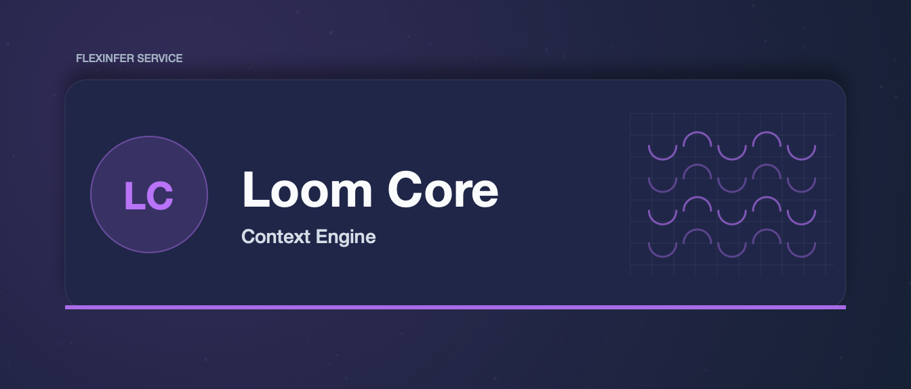

# Loom Core

Go backend for the Loom ecosystem:

- MCP server implementations (`cmd/mcp-*/`)
- `loom` CLI for config generation/sync, daemon control, and tooling (`cmd/loom/`)
- `loomd` daemon for MCP server lifecycle and tool routing (`cmd/loomd/`)

## Implementation Status

Current shipped/in-progress status is tracked in one place:

- `docs/IMPLEMENTATION_STATUS.md`

Roadmap and execution sequencing:

- `ROADMAP.md`
- `docs/planning/2026-02-17-architecture-refactor-opportunities.md`

## Start Here By Role

- Users/operators: `docs/USER_GUIDE.md`
- Contributors/developers: `docs/DEVELOPER_GUIDE.md`
- System architecture: `docs/ARCHITECTURE.md`
- Full docs index: `docs/README.md`

## Quickstart (Local)

```bash
make bootstrap-local
./bin/loom start
./bin/loom status
```

If you use linked Git worktrees or agent shells that invoke nested Git/Go commands,
run this once after cloning and again after creating a new main checkout:

```bash
make git-setup
```

That repairs the main worktree Git config, installs shared `pre-commit`/`pre-push`
hooks into the common Git dir, and makes local hooks safe for Codex, Claude, and Gemini.

Manual path:

```bash
make build
./bin/loom sync all --regen --loom-mode
./bin/loomd
```

## Daily Workflows

- Safe local upgrade: `make dev-upgrade`
- Force daemon restart upgrade: `make dev-reload`
- Health check: `curl http://localhost:9876/health`
- Main HUD: `https://hud.flexinfer.ai` served by Kubernetes deployment `loom-hub/mobile-hud`
- Verify main HUD deployment: `kubectl -n loom-hub rollout status deployment/mobile-hud`
- Local development HUD only: `./bin/loom hud --port 3333`
- Local HUD launchd lifecycle (macOS): `./bin/loom hud install`, `./bin/loom hud status`
- Agent token launchd sync (Codex/Gemini): `./bin/loom sync agent-tokens install`, `./bin/loom sync agent-tokens status`

## Notable Capabilities

- Multi-platform MCP config generation/sync (Codex, Claude, Gemini, Zed, VS Code, Kilocode).
- Agent orchestration primitives via `mcp-agent-context` (sessions, tasks, memory, workflows, worktrees).
- Project-aware sandbox execution via `mcp-devbox` (Docker/K8s backends, tar-pipe sync, git-clone initContainers).
- Workspace branding automation via `mcp-brand-kit` wrapping `libs/banner-kit` for repository banners, icons, linting, previews, and explicit render/fix operations.
- iOS companion app with sandbox monitoring, ops workflows, and push diagnostics.
- Optional enterprise security controls (RBAC, audit, cost attribution, OAuth 2.1) with HUD dashboards.
- Streamable HTTP remote transport for team and remote daemon topologies.
- Skills generation with priority assembly, variable escaping, and asset validation.

## Development Quality Gates

```bash
go test ./...
golangci-lint run
```

In restricted environments:

```bash
make test-sandbox
```

See `AGENTS.md` for agent-specific working conventions.
