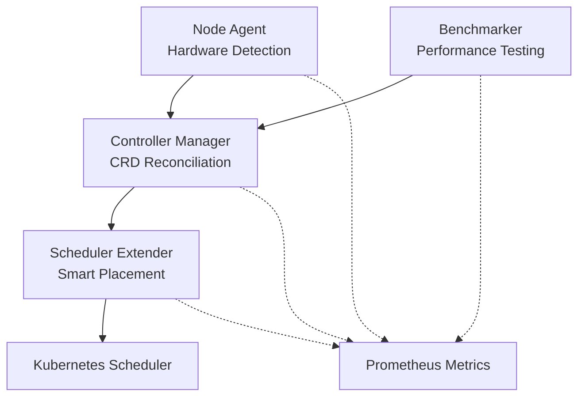

# FlexInfer

**Smart GPU scheduling for AI workloads in Kubernetes**

FlexInfer is a Kubernetes-native solution that automatically discovers GPU capabilities, benchmarks AI model performance, and intelligently schedules workloads to optimize throughput and resource utilization.

## Current Status

FlexInfer is **functional and working** with comprehensive implementations of all core components:

- ✅ **Node Agent**: Hardware detection and labeling system
- ✅ **Controller Manager**: Complete CRD reconciliation with status management
- ✅ **Scheduler Extender**: Advanced filtering and scoring algorithms
- ✅ **Benchmarker**: Model performance measurement framework
- ✅ **API Types**: Comprehensive CRD definitions with status tracking
- ✅ **Test Suite**: Extensive unit tests across all components

The project is ready for deployment but needs **deployment tooling** (Helm templates, installation guides) to make it accessible to end users.

## Features

### ✅ **Currently Implemented**

- **Hardware Discovery**: Automatic detection of GPU vendor, architecture, VRAM, and capabilities
- **Model Performance Benchmarking**: Automated measurement of tokens/second for model-device pairs
- **Intelligent Scheduling**: Multi-factor scoring combining performance, utilization, and cost
- [x] **Model Caching**: Intelligent model artifact management with deduplication and pre-warming
- [x] **Resource Management**: Complete lifecycle management of AI workload deployments
- **Status Tracking**: Comprehensive status conditions and phase management
- **Event System**: Detailed event recording for debugging and monitoring
- **Metrics Collection**: Prometheus-compatible metrics for all components
- **Finalizer Handling**: Proper cleanup of resources and dependencies

### 🔄 **Partially Implemented**

- **Deployment Tooling**: Basic Helm chart structure exists but needs completion
- **Integration Testing**: Framework exists but needs more comprehensive scenarios

### 📋 **Planned Features**

- **Advanced Benchmarking**: Real model loading and inference testing
- **KV-Cache Tiering**: GPU HBM to host DDR memory management
- **Harbor OCI Plugin**: Direct model registry integration
- **Multi-tenancy**: Namespace isolation and resource quotas

## Architecture

FlexInfer consists of five cooperating components:


```mermaid
graph TB
    Agent[Node Agent<br/>Hardware Detection] --> Controller[Controller Manager<br/>CRD Reconciliation]
    Benchmarker[Benchmarker<br/>Performance Testing] --> Controller
    Controller --> Scheduler[Scheduler Extender<br/>Smart Placement]
    Scheduler --> K8s[Kubernetes Scheduler]

    Agent -.-> Metrics[Prometheus Metrics]
    Controller -.-> Metrics
    Benchmarker -.-> Metrics
    Scheduler -.-> Metrics
```

See [AGENTS.md](AGENTS.md) for detailed component documentation.

## Quick Start

### Prerequisites

- Kubernetes 1.25+
- GPU-enabled nodes with appropriate drivers
- Prometheus (optional, for metrics)

### Installation

```bash
# Install CRDs
kubectl apply -f config/crd/ai.flexinfer_modeldeployments.yaml

# Install RBAC
kubectl apply -f config/rbac/role.yaml

# Deploy components (manual deployment - Helm chart needs completion)
# See charts/flexinfer/ for Helm template structure
```

### Example Usage

```yaml
apiVersion: ai.flexinfer/v1alpha1
kind: ModelDeployment
metadata:
  name: llama-7b
spec:
  model:
    source: "ollama://llama2:7b"
    quantization: "Q4_K_M"
  replicas: 2
  resources:
    limits:
      nvidia.com/gpu: 1
      memory: "16Gi"
---
apiVersion: ai.flexinfer/v1alpha1
kind: ModelCache
metadata:
  name: llama-7b-cache
spec:
  source: "huggingface://meta-llama/Llama-2-7b-chat-hf"
  storageStrategy: SharedPVC
```

## Development

### Building

```bash
# Build all components
make build

# Run tests
make test

# Generate CRD manifests
make manifests
```

### Testing

```bash
# Run unit tests
make test

# Run specific component tests
go test ./controllers/...
go test ./agents/...
```

## TODO

### High Priority (Deployment Ready)

- [ ] **Complete Helm templates** - Finish charts/flexinfer/ with proper configurations
- [ ] **Installation documentation** - Step-by-step deployment guides
- [ ] **Integration tests** - End-to-end testing scenarios
- [ ] **Real benchmarking** - Replace mock with actual model inference testing

### Medium Priority (Production Ready)

- [ ] **Performance optimization** - Memory usage and startup time improvements
- [ ] **Security hardening** - RBAC refinements and security scanning
- [ ] **Monitoring dashboards** - Grafana dashboards for operational visibility
- [ ] **Documentation** - API documentation and troubleshooting guides

### Low Priority (Advanced Features)

- [ ] **KV-Cache tiering** - Advanced memory management
- [ ] **Harbor OCI integration** - Direct model registry support
- [ ] **Multi-tenancy** - Namespace isolation features
- [ ] **CNCF submission** - Sandbox application preparation

## Contributing

See [CONTRIBUTING.md](CONTRIBUTING.md) for development guidelines.

## License

Apache 2.0 - see LICENSE file for details.
