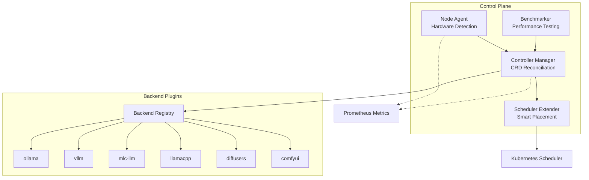

# FlexInfer

**Smart GPU scheduling for AI workloads in Kubernetes**

FlexInfer is a Kubernetes-native solution that automatically discovers GPU capabilities, benchmarks AI model performance, and intelligently schedules workloads to optimize throughput and resource utilization.

## Current Status

FlexInfer is **functional and working** with comprehensive implementations of all core components:

- ✅ **Node Agent**: Hardware detection and labeling system
- ✅ **Controller Manager**: Complete CRD reconciliation with status management
- ✅ **Scheduler Extender**: Advanced filtering and scoring algorithms
- ✅ **Benchmarker**: Model performance measurement framework
- ✅ **API Types**: Comprehensive CRD definitions with status tracking
- ✅ **Test Suite**: Extensive unit tests across all components
- ✅ **Backend Plugin System**: Centralized backend configuration (ollama, vllm, mlc-llm, llamacpp, diffusers, comfyui)
- ✅ **Model v1alpha2**: Simplified single-resource API for homelab users

The project is ready for deployment but needs **deployment tooling** (Helm templates, installation guides) to make it accessible to end users.

## Features

### ✅ **Currently Implemented**

- **Hardware Discovery**: Automatic detection of GPU vendor, architecture, VRAM, and capabilities
- **Model Performance Benchmarking**: Automated measurement of tokens/second via real inference (Ollama, vLLM, MLC-LLM, llama.cpp)
- **Intelligent Scheduling**: Multi-factor scoring combining performance, utilization, and cost
- [x] **Model Caching**: Intelligent model artifact management with deduplication and pre-warming
- [x] **Resource Management**: Complete lifecycle management of AI workload deployments
- **Status Tracking**: Comprehensive status conditions and phase management
- **Event System**: Detailed event recording for debugging and monitoring
- **Metrics Collection**: Prometheus-compatible metrics for all components
- **Finalizer Handling**: Proper cleanup of resources and dependencies

### 🔄 **Partially Implemented**

- **Deployment Tooling**: Basic Helm chart structure exists but needs completion
- **Integration Testing**: Framework exists but needs more comprehensive scenarios
- **ModelCache Downloader**: Supports `huggingface-cli` in the controller; OCI-based sources are still TODO.
- **Scale-to-Zero Proxy**: Basic skeleton exists. Needs robust "Activator" pattern (request buffering, API compatibility).
- **Smart Routing (L7)**: Current scheduler is L4 (Pods). Missing L7 Router for KV-Cache locality (requests).

### 📋 **Planned Features / Innovation Roadmap**

- **"Flash-Loader" Sidecar**: P2P/RDMA model loading to bypass disk I/O.
- **Context-Aware Router**: L7 Prefix-Caching router for "Chat with Doc" workloads.
- **Dynamic Multi-LoRA**: Hot-swapping adapters on running deployments.
- **Spot-Instance Resilience**: Proactive draining on termination notice.

## Architecture

FlexInfer consists of five cooperating components with a pluggable backend system:


```mermaid
graph TB
    subgraph "Control Plane"
        Agent[Node Agent<br/>Hardware Detection] --> Controller[Controller Manager<br/>CRD Reconciliation]
        Benchmarker[Benchmarker<br/>Performance Testing] --> Controller
        Controller --> Scheduler[Scheduler Extender<br/>Smart Placement]
    end

    subgraph "Backend Plugins"
        Controller --> Backend[Backend Registry]
        Backend --> Ollama[ollama]
        Backend --> VLLM[vllm]
        Backend --> MLC[mlc-llm]
        Backend --> LlamaCpp[llamacpp]
        Backend --> Diffusers[diffusers]
        Backend --> ComfyUI[comfyui]
    end

    Scheduler --> K8s[Kubernetes Scheduler]

    Agent -.-> Metrics[Prometheus Metrics]
    Controller -.-> Metrics
```

The **Backend Plugin System** centralizes all backend-specific configuration (images, ports, args, environment variables, probes) into a single interface, making it easy to add new inference backends.

See [AGENTS.md](AGENTS.md) for detailed component documentation.

## GPU Compatibility

FlexInfer supports multiple GPU architectures with backend-specific considerations:

| GPU Architecture | Compute Capability | Ollama | vLLM | MLC-LLM | Notes |
|-----------------|-------------------|--------|------|---------|-------|
| Maxwell (GTX 980 Ti) | 5.x | ✅ | ❌ | ✅* | *FP32 only, see [Maxwell Guide](build/README-maxwell.md) |
| Pascal (GTX 1080) | 6.x | ✅ | ✅ | ✅ | Full support |
| Volta+ (RTX 20xx+) | 7.0+ | ✅ | ✅ | ✅ | Full support with Tensor Cores |
| AMD (RX 7900) | ROCm | ✅ | ✅ | ✅ | ROCm 5.6+ required |

### Special GPU Documentation

- **[Maxwell GPUs (GTX 980 Ti, etc.)](build/README-maxwell.md)** - Running MLC-LLM on older NVIDIA GPUs without FP16 support

## Quick Start

### Prerequisites

- Kubernetes 1.25+
- GPU-enabled nodes with appropriate drivers
- Prometheus (optional, for metrics)

### Installation

```bash
# Helm (recommended)
helm upgrade --install flexinfer charts/flexinfer \
  --namespace flexinfer-system \
  --create-namespace
```

### Example Usage (v1alpha2 - Recommended)

The simplified `Model` CRD replaces the multi-file workflow with a single resource:

```yaml
apiVersion: ai.flexinfer/v1alpha2
kind: Model
metadata:
  name: qwen3-8b
spec:
  backend: mlc-llm
  source: HF://mlc-ai/Qwen3-8B-q4f16_1-MLC
  gpu:
    shared: homelab-gpu    # Models with same name share GPU
    priority: 100          # Higher = more important
```

That's it! Cache, serverless scaling, and GPU scheduling are all handled automatically.

#### Supported Backends

| Backend | Port | Description |
|---------|------|-------------|
| `ollama` | 11434 | Downloads models on-demand |
| `vllm` | 8000 | OpenAI-compatible, high throughput |
| `mlc-llm` | 8000 | Pre-compiled models, AMD ROCm support |
| `llamacpp` | 8080 | GGUF models, CPU/GPU hybrid |
| `diffusers` | 8000 | Image generation (Stable Diffusion) |
| `comfyui` | 8188 | Workflow-based image generation |
| `vllm-omni` | 8000 | Diffusion models with OpenAI API |

#### GPU Sharing

Multiple models can time-share a GPU using the `gpu.shared` field:

```yaml
# Both models share the same GPU, with qwen3 having higher priority
---
apiVersion: ai.flexinfer/v1alpha2
kind: Model
metadata:
  name: qwen3-8b
spec:
  backend: mlc-llm
  source: HF://mlc-ai/Qwen3-8B-q4f16_1-MLC
  gpu:
    shared: my-gpu
    priority: 100
---
apiVersion: ai.flexinfer/v1alpha2
kind: Model
metadata:
  name: llama3-8b
spec:
  backend: vllm
  source: HF://meta-llama/Meta-Llama-3-8B
  gpu:
    shared: my-gpu
    priority: 50
```

When a request arrives for the higher-priority model, the lower-priority one is preempted.

### Legacy API (v1alpha1)

The v1alpha1 API with separate `ModelDeployment`, `GPUGroup`, and `ModelCache` resources is still supported but deprecated:

```yaml
apiVersion: ai.flexinfer/v1alpha1
kind: ModelDeployment
metadata:
  name: llama-7b
spec:
  backend: ollama
  model: llama2:7b
  replicas: 1
  modelCacheRef: llama-7b-cache
```

## Development

### Building

```bash
# Build all components
make build

# Run tests
make test

# Generate CRD manifests
make manifests
```

### Testing

```bash
# Run unit tests
make test

# Run specific component tests
go test ./controllers/...
go test ./agents/...
```

## TODO

### High Priority (Deployment Ready)

- [ ] **Complete Helm templates** - Finish charts/flexinfer/ with proper configurations
- [ ] **Installation documentation** - Step-by-step deployment guides
- [ ] **Integration tests** - End-to-end testing scenarios
- [x] **Real benchmarking** - Real inference benchmarking (Ollama, vLLM, MLC-LLM, llama.cpp)

### Medium Priority (Production Ready)

- [ ] **Performance optimization** - Memory usage and startup time improvements
- [ ] **Security hardening** - RBAC refinements and security scanning
- [ ] **Monitoring dashboards** - Grafana dashboards for operational visibility
- [ ] **Documentation** - API documentation and troubleshooting guides

### Low Priority (Advanced Features)

- [ ] **KV-Cache tiering** - Advanced memory management
- [ ] **Harbor OCI integration** - Direct model registry support
- [ ] **Multi-tenancy** - Namespace isolation features
- [ ] **CNCF submission** - Sandbox application preparation

## Contributing

See [CONTRIBUTING.md](CONTRIBUTING.md) for development guidelines.

## License

Apache 2.0 - see LICENSE file for details.
