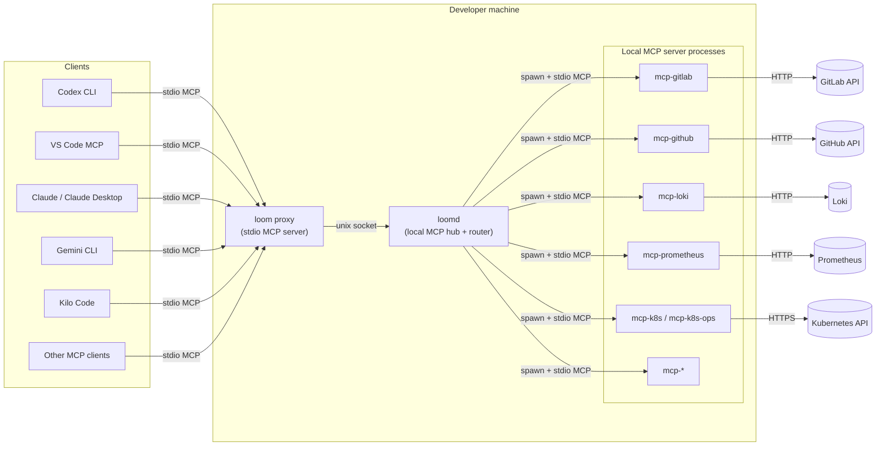
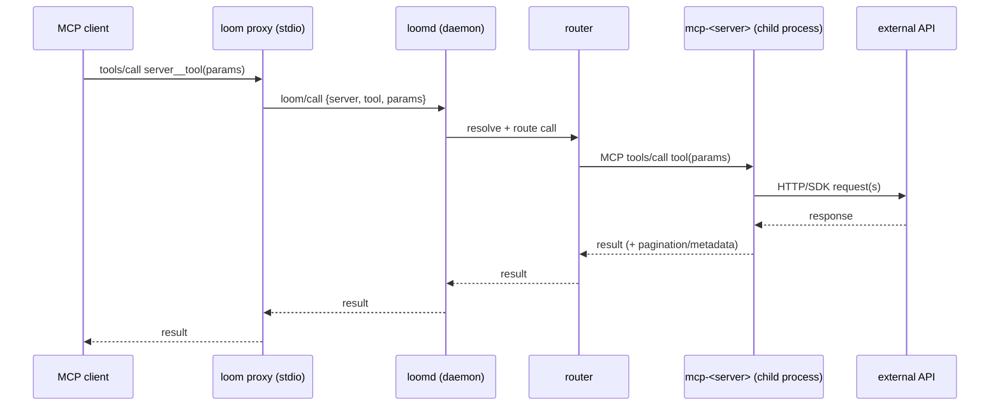
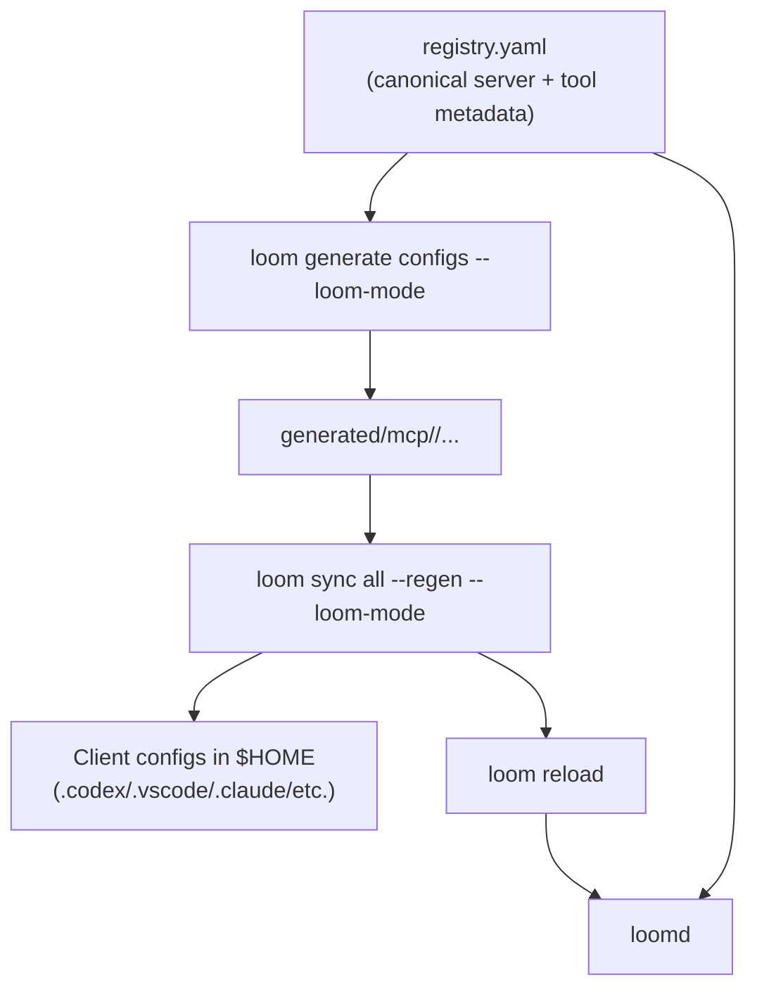
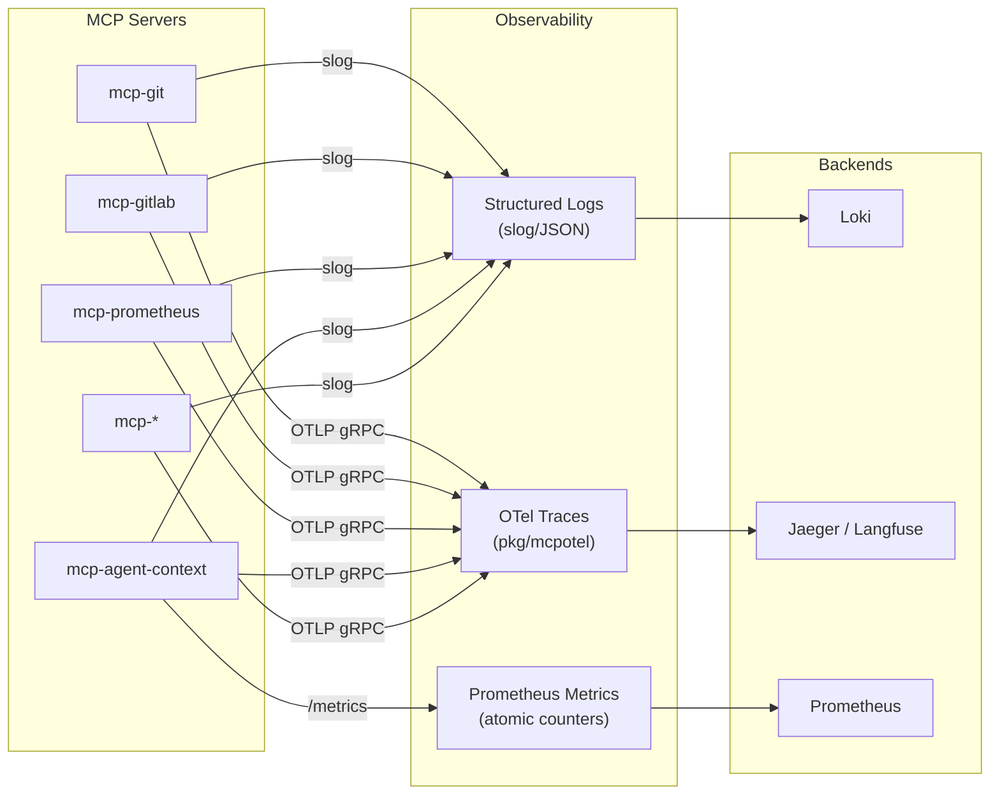

# Loom Core Architecture

This document describes Loom Core’s architecture at a “how the pieces fit together” level. For day-to-day commands, see:

- User guide: `docs/USER_GUIDE.md`
- Developer guide: `docs/DEVELOPER_GUIDE.md`

## High-level components

Notes:

- **Clients** talk to a single local entrypoint (`loom proxy`) when using `--loom-mode` configs.
- **`loomd`** owns routing, lifecycle, and policy (what servers exist, env/secrets, etc.).
- **MCP servers** are typically separate binaries (`cmd/mcp-*/`) spawned as local child processes and spoken to over stdio MCP.

## Tool call flow (sequence)

## Registry and configuration artifacts

Loom uses a shared registry (`registry.yaml`) to generate downstream configs and manifests.

## Observability

### Tracing (`pkg/mcpotel`)

All MCP servers use `TracedToolHandler` middleware to create per-tool-call spans. The tracer initializes as a noop when `OTEL_EXPORTER_OTLP_ENDPOINT` is unset, so tracing adds zero overhead by default. Spans include `agent_id`, `session_id`, and `namespace` attributes when present in tool arguments.

Servers with tracing: `mcp-agent-context`, `mcp-git`, `mcp-gitlab`, `mcp-prometheus`.

### Metrics (`pkg/agentcontext`)

`mcp-agent-context` maintains atomic counters for sessions, embedding calls, recall hit/miss rates, graph operations, workflows, compression, and per-tier memory items. The `agent_context_stats` tool returns a live snapshot. Prometheus-format export is available via `PrometheusFormat()`.

### Logging (`pkg/mcplog`)

All servers use `slog`-based structured logging. Error paths log warnings with contextual fields (IDs, operation names, error details) rather than silently discarding errors.

## Reliability and safety design notes

- **Stdio concurrency**: requests to local stdio-backed MCP servers are serialized per-server in `loomd` to avoid transport corruption (stdio is a single shared byte stream).
- **Pagination + bounded output**: list/search tools in API-backed MCPs expose `page`/`per_page` and return pagination metadata; large responses are capped to avoid client timeouts and OOMs.
- **Secrets hygiene**: generated configs are validated for plaintext secrets (`loom validate configs`); registry values should use `${env:...}` / `${secret:...}` indirections.
- **Best-effort error handling**: Internal cleanup operations (compaction, TTL sweeps, rollbacks) log failures as warnings but do not abort the parent operation. This prevents cascading failures while keeping errors visible.

## Diagram sources

Source `.mmd` files (including auto-generated internal/package dependency graphs) live under `docs/diagrams/`.
