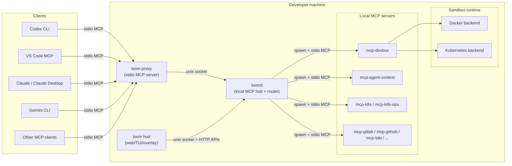
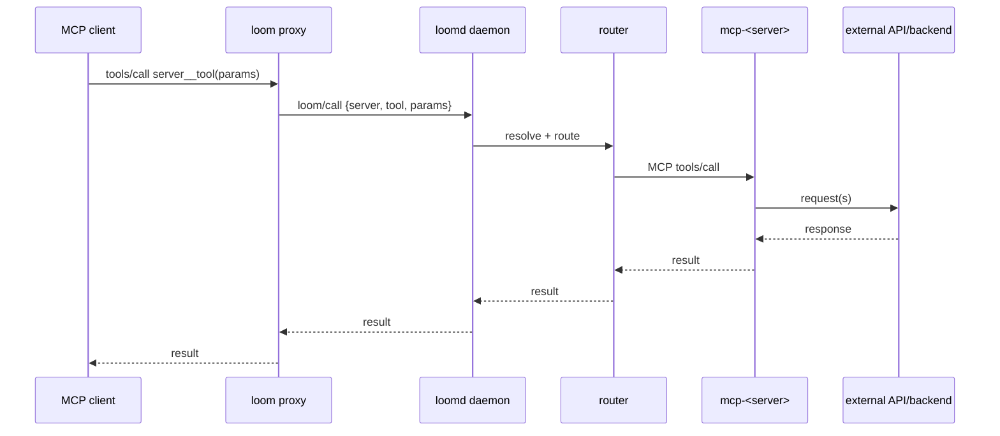
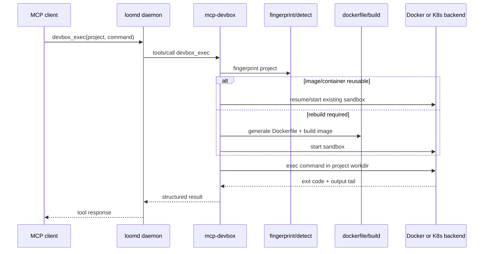
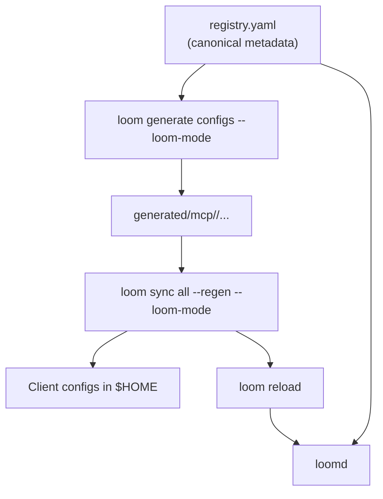
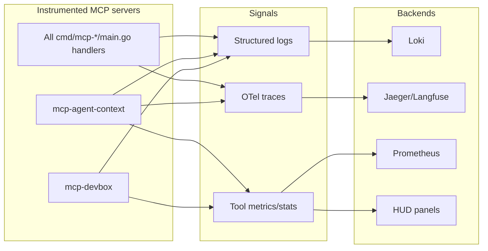

# Loom Core Architecture

This document explains how Loom Core components fit together at runtime.

For operational commands, see:

- `docs/USER_GUIDE.md`
- `docs/DEVELOPER_GUIDE.md`
- `docs/IMPLEMENTATION_STATUS.md` for shipped vs in-progress status

## High-Level Components

## Tool Call Flow

## Sandbox Execution Flow (`mcp-devbox`)

Design details:

- Workspace-root mounting enables monorepo workflows and sibling module access.
- Per-project lifecycle locks prevent concurrent ensure/start races.
- Idle sandboxes pause/stop via reaper loop; active execs are protected from reaping.

## Registry and Configuration Flow

## Skill and Instruction Generation

Loom provides a unified mechanism for delivering skills and instructions across multiple AI platforms (Codex, Claude, Kilocode, Gemini).

### Skills Registry

The `skills-registry.yaml` file is the source of truth for all skills. Each skill can have multiple target formats:

- **Command (`command`):** Generates slash commands (e.g., `.claude/commands/`).
- **Rule (`rule`):** Generates rule files (e.g., `.claude/rules/`).
- **Skill Bundle (`skill`):** Generates full skill directories with scripts, references, and assets (e.g., `~/.codex/skills/`).
- **Instruction (`instruction`):** Appends instructions to a composite platform instruction file.

### Instruction Files

For core workflows that should always be active, Loom generates composite instruction files:

- **Claude/Codex/Kilocode:** `instructions.md`
- **Gemini CLI:** `GEMINI.md` (required by Gemini CLI for hierarchical instructions).

### Platform Sync and Conflict Avoidance

Some platforms have specific requirements for where files reside:

- **Gemini CLI:** Errors if duplicate skill names are found in both the workspace (`.gemini/skills/`) and user home (`~/.gemini/skills/`). Loom mitigates this by generating Gemini skills directly to the home directory and cleaning them from the repository.
- **Codex:** Prefers skills in `~/.codex/skills/` but Loom generates them into the repo during development so they can be tracked and synced.

## HUD Architecture

`loom hud` is a local API + UI layer for:

- server health and inventory
- agent sessions, tasks, workflows, and memory views
- sandbox summary visibility via `/api/sandbox` (backed by `devbox_summary`)
- optional macOS native overlay and terminal UI mode

`loom agent ...` commands prefer HUD REST endpoints and fall back to daemon socket tool calls, so hook/automation flows continue when HUD is not running.

## Observability

Notes:

- Tracing wrappers now ship across all `cmd/mcp-*/main.go` MCP binaries.
- Daemon-level span expansion (routing/spawn/proxy lifecycle) remains tracked in `ROADMAP.md`.
- `pkg/mcpotel` is noop unless `OTEL_EXPORTER_OTLP_ENDPOINT` is set.

## Reliability and Safety Notes

- Per-server stdio calls are serialized to avoid transport corruption.
- Pagination and response-size caps limit timeout/OOM risk for large APIs.
- Secrets should be referenced indirectly (`${env:...}` / `${secret:...}`), not stored plaintext.
- Best-effort cleanup paths log warnings instead of crashing parent workflows.

## Diagram Sources

Diagram source files live under `docs/diagrams/`.
