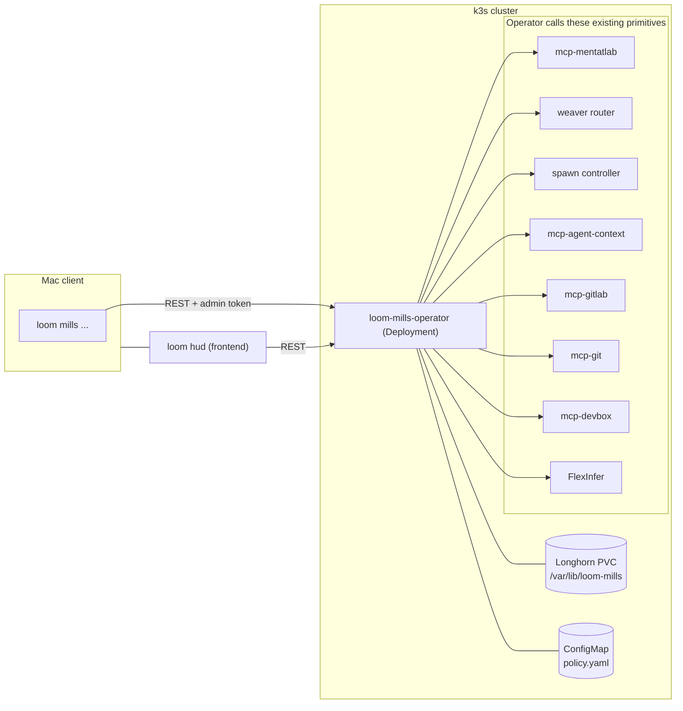

# Loom Mills — Operator Reference

Loom Mills is the cluster-resident meta-orchestration layer above weaver, spawn, and MentatLab. It runs continuous software development with a planning **Council** that emits `.loom/` artifacts + backlog deltas and a deterministic, gated execution **Pipeline** that turns each backlog item into a merged change. "CI above CI for agents."

This document is the architecture and operator reference for Mills v1. For day-2 procedures (pause/resume, recovery, replay, rollout staging), see `docs/MILLS_RUNBOOK.md`. The active forward-looking design is `.loom/92-…mills-v2…md` through `.loom/94-…mills-v2…md`.

## High-Level Architecture



The Mac is read-mostly; the operator pod is the only writer. SQLite + WAL + Longhorn RWO PVC is the canonical store. `.loom/backlog/*.yaml` is a derived export; GitLab issues are a federated mirror.

## Components

| Component | Source | Purpose |
|---|---|---|
| **Operator binary** | `cmd/loom-mills-operator/` | Process lifecycle, REST + MCP server, healthz/readyz, /metrics. |
| **Canonical store** | `pkg/mills/store/` | SQLite + WAL; migrations under `pkg/mills/store/migrations/`. DAOs per surface (`dao_backlog.go`, `dao_council.go`, `dao_pipeline.go`, `dao_eval.go`, …). |
| **Policy + budget** | `pkg/mills/policy.go`, `pkg/mills/policy_manager.go`, `pkg/mills/budget.go` | YAML policy with fsnotify hot-reload; per-tier rolling budgets. |
| **Reconciler + scheduler** | `pkg/mills/reconciler.go`, `pkg/mills/scheduler.go` | 60s tick (idle-throttled to 5min); cron + event triggers. |
| **Council** | `pkg/mills/council/` | `roadmap.go` extractor, `brief.go` assembler, `reviewer.go` dispatcher, `editor.go`, `artifacts.go`, `backlog_mutator.go`. |
| **Pipeline** | `pkg/mills/pipeline/` | `runner.go` per-DAG engine, `dispatcher.go` per-stage workers, `integrator.go` fan-out, `escalate.go` handoff path, `recursion.go` (v2). |
| **Gates** | `pkg/mills/gates/` | Pure-Go gates (`diff_size`, `scope`, `path_policy`, `secret_scan`, `commit_format`) and LLM-judged gates (`spec_conformance`, `pr_self_review`, `regression`). |
| **Eval** | `pkg/mills/eval/` | Loop A (artifact judge), Loop B (per-merge attribution + Council ROI), Loop C (cross-run consistency). |
| **Clients** | `pkg/mills/clients/` | Wrappers for FlexInfer, GitLab, Git branch merger, MCP hub (devbox/handoff/worktree), HUD spawn API. |
| **MentatLab template** | `cmd/mcp-mentatlab/templates/mills-default-pipeline.yaml` | Default DAG: `plan_slice → research → implement → tests → pr_self_review → mr → ci_watch → merge → cleanup`. |
| **HUD `Mills` view** | `internal/hud/frontend/src/lib/components/Mills/` | Four panels: `CouncilPanel`, `PipelinesPanel`, `BacklogPanel`, `EvalPanel`. |
| **Mac CLI** | `cmd/loom/cmd_mills*.go` | `loom mills status`, `loom mills council {dryrun,run}`, `loom mills backlog {list,sync}`, `loom mills eval list`, `loom mills pipelines list`. |

## Deployment

The operator runs as a single-replica Deployment in the `loom-mills` namespace on k3s.

| Manifest | Purpose |
|---|---|
| `platform/gitops/k3s/mills/namespace.yaml` | `loom-mills` namespace |
| `platform/gitops/k3s/mills/serviceaccount.yaml` + `role.yaml` + `rolebinding.yaml` | RBAC for cross-namespace secret read (`cluster-agent-auth`, `cluster-agent-api-keys`) and own-namespace ConfigMap patch |
| `platform/gitops/k3s/mills/pvc.yaml` | `mills-state` Longhorn RWO 5Gi |
| `platform/gitops/k3s/mills/deployment.yaml` | Deployment with amd64 `nodeSelector`, liveness/readiness probes, `imagePullSecrets: [harbor-creds]`, and a `/workspace/loom-core` repo-root mount |
| `platform/gitops/k3s/mills/service.yaml` | ClusterIP for in-cluster MCP/REST |
| `platform/gitops/k3s/mills/configmap-policy.yaml` | Mounted at `/etc/loom-mills/policy.yaml` |
| `platform/gitops/k3s/mills/servicemonitor.yaml` | Prometheus scrape |
| `platform/gitops/k3s/mills/cronjob-backup.yaml` | Nightly SQLite dump → MinIO `loom-mills-backups/` |

Bring-up:

```bash
# From the platform/gitops repo:
flux reconcile kustomization apps -n flux-system
kubectl get deploy -n loom-mills loom-mills-operator
kubectl logs -n loom-mills deploy/loom-mills-operator --tail=200
```

Healthz and readyz live on the metrics listener (`:9090` by default). `/healthz` checks SQLite liveness. `/readyz` is service readiness: it flips to 200 after migrations, policy load, and operator wiring complete. It does not mean Mills is safe to run autonomous writes.

Autonomy readiness is reported by `/api/mills/status` and `/api/mills/capabilities`. These responses include `autonomy_ready`, `autonomy_blockers`, and a capability matrix with rows for SQLite, policy, admin auth, repo root, FlexInfer, GitLab, HUD spawn, MCP hub/session, dispatcher write stages, council participants, branch contract, and KPI writer. When `policy.enabled=true`, required red or stubbed rows keep `autonomy_ready=false` while read-only API surfaces can remain available.

## Configuration

Environment variables (canonical prefix `LOOM_MILLS_*`); see `cmd/loom-mills-operator/config.go` for the authoritative list.

| Var | Default | Purpose |
|---|---|---|
| `LOOM_MILLS_DB_PATH` | `/var/lib/loom-mills/state.db` | SQLite path (Longhorn-backed). |
| `LOOM_MILLS_POLICY_PATH` | `/etc/loom-mills/policy.yaml` | YAML policy; fsnotify hot-reloaded. |
| `LOOM_MILLS_HTTP_ADDR` | `:8090` | REST + MCP listener. |
| `LOOM_MILLS_METRICS_ADDR` | `:9090` | `/healthz`, `/readyz`, `/metrics`. |
| `LOOM_MILLS_REPO_ROOT` | `/workspace/loom-core` | Council artifact write root + brief reader root. |
| `LOOM_MILLS_ENABLED` | unset | `true`/`false` overrides the policy's `enabled` bit; unset defers to the YAML. |
| `LOOM_MILLS_DEBUG` | unset | Enables debug-level slog. |
| `FLEXINFER_PROXY_URL` | unset | Required for LLM-judged gates and the research stage. |
| `FLEXINFER_TOKEN` / `FLEXINFER_JUDGE_MODEL` / `FLEXINFER_WEAVER_MODEL` | unset | FlexInfer client tuning. |
| `GITLAB_API_URL` / `GITLAB_TOKEN` / `GITLAB_PROJECT` | unset | Required for `mr/ci_watch/merge/cleanup` stages and escalation issues. |
| `LOOM_HUD_URL` / `LOOM_HUD_TOKEN` | unset | Required for `plan_slice/implement/pr_self_review` spawn-driven stages. |
| `LOOM_MCP_HUB_URL` / `LOOM_MCP_PROFILE` | unset | Required for devbox/handoff/worktree clients. |
| Admin token | env (operator-side) | Required for mutating endpoints; check `cmd/loom-mills-operator/auth.go`. |

At startup, the operator attempts to bootstrap `LOOM_MILLS_REPO_ROOT` as a shallow `services/loom-core` checkout when GitLab URL/project/token configuration and the `git` binary are available. In k3s this path is mounted from the singleton Longhorn PVC at `/workspace/loom-core`, sharing the same single-writer ownership model as SQLite. If the clone, fetch, git metadata, `.loom` existence, or writability check fails, the pod still serves read-only APIs but the `repo_root` capability stays red and unattended backlog execution remains blocked.

When a backing service env is missing, the operator boots in a degraded mode: affected stages fall back to a NoOp dispatcher and the gap is logged and exposed in the capability matrix. The scheduler and read-only APIs may still run, but the reconciler skips queued work while `autonomy_ready=false`; no unattended pipeline starts are allowed until the required capability rows are green.

## Policy reference

`pkg/mills/policy.go` defines the schema. The on-disk YAML maps 1:1.

```yaml
version: 1
enabled: true                            # kill switch (defaults to enabled when omitted)
budgets:
  council:
    max_usd_per_run:  15.00
    max_usd_per_day:  50.00
  pipeline:
    max_usd_per_run:   5.00
    max_usd_per_day:  75.00
    max_concurrent_runs: 4
    max_runs_per_day:   20
council:
  schedule_cron: "0 5 * * *"
  triggers:
    on_roadmap_change:  true
    on_incident:        true
    on_merge_drift_hours: 48
  ensemble:
    editor:    { name: editor,   model: claude-opus,           backend: spawn }
    reviewers:
      - { name: architect, model: claude-opus,         backend: spawn,     lens: architecture }
      - { name: security,  model: codex-gpt5,          backend: spawn,     lens: security }
      - { name: tech_debt, model: llama-4-70b-instruct, backend: flexinfer, lens: tech_debt }
    judge:     { name: judge,    model: llama-4-70b-instruct,  backend: flexinfer }
  artifacts_branch:           "council/{date}"
  artifacts_merge_strategy:   "fast-merge-loom-only"   # or "always-mr"
pipeline:
  default_template: mills-default-pipeline
  protected_paths:
    - "platform/gitops/**"
    - "cmd/loomd/**"
    - "**/*auth*.go"
    - "**/secret*.yaml"
  per_label_overrides:
    - { label: "auto",         auto_merge: true,  human_review: false }
    - { label: "human_review", auto_merge: false, human_review: true }
  retry:
    max_attempts:     3
    cooldown_seconds: 300
  auto_revert_on_regression: false
human_handoff:
  on_escalation_create_handoff: true
  on_escalation_create_issue:   true
  notify_agent_id: ""
```

Edits to the mounted ConfigMap are picked up via fsnotify within seconds; the operator logs `policy reloaded` on success and continues on the prior version on parse error. In-flight runs continue under the policy they captured at start; new runs use the latest.

## Persistence schema

`pkg/mills/store/migrations/001_initial.sql` is the v1 schema. Key tables:

| Table | Purpose |
|---|---|
| `roadmap_intents` | Themes/priorities/constraints extracted from `ROADMAP.md`; idempotent by content hash. |
| `backlog_items` | Canonical backlog with id `MILLS-YYYY-MM-DD-NNN`, state machine `queued|running|merged|escalated|paused`, label set, priority, spec doc/anchor, success criteria. |
| `council_runs` | Per-run rows: trigger, ensemble snapshot, sidecar JSON, eval verdict, cost. |
| `pipeline_runs` | Per-DAG rows: backlog item, current stage, retry count, integrator parent (when fan-out), MR iid, total cost. |
| `stage_results` | Per-stage row attached to a run: stage id, output JSON, started/ended/cost. |
| `gate_outcomes` | Per-gate verdicts: `pass`/`fail`/`skip` with reasons. |
| `kpi_snapshots` | Rolling KPI samples. |
| `eval_scores` | Loop A artifact scores, Loop B per-merge outcomes, Loop C cross-run findings. Subject types: `council_run`, `pipeline_run`, `cross_run`. |
| `events` | Append-only structured event log used by reconciler + attribution. |

Backups: nightly CronJob dumps `state.db` to MinIO bucket `loom-mills-backups/<UTC>.db`. Retention 30 days.

## Council brief composition

Each Council run assembles a deterministic brief, scoped to ≤16k tokens:

1. `roadmap_intents` (latest snapshot) — themes, priorities, constraints.
2. `.loom/00-index.md` — current planning index.
3. Recent worklog (`.loom/50-worklog.md`) — last 7 days, summarized if too large.
4. `agent-context` recall: `agent_context_recall_enhanced(query="loom-core/roadmap recent")`.
5. Open GitLab issues with mills labels.
6. Recent merged MRs (last 7 days) via `mcp-gitlab`.
7. Alertmanager active alerts via `mcp-alertmanager`.
8. Recent Loki errors via `mcp-loki`.
9. Current KPI snapshot (`kpi_snapshots` latest row).
10. Cross-run findings (Eval Loop C) — most recent contradictions or stale plans.

The brief is wrapped with a fixed system prompt (in `pkg/mills/council/prompts/`); reviewers receive a lens-specific addendum; the editor receives the full brief plus reviewer outputs as tool-result content.

## Pipeline stages

The default DAG is `cmd/mcp-mentatlab/templates/mills-default-pipeline.yaml`:

```
plan_slice → research → implement → tests → pr_self_review → mr → ci_watch → merge → cleanup
                                              ↓
                                     (auto_gate: each transition runs gates)
```

| Stage | Worker backend | Notes |
|---|---|---|
| `plan_slice` | spawn (Claude/Codex) | Reads spec doc + sidecar; emits per-stage list with file/test scope. |
| `research` | weaver (FlexInfer) | Domain-bounded subagent; populates context. |
| `implement` | spawn + worktree | Allocates a per-DAG worktree via `agent_worktree_allocate`; commits with conventional format. |
| `tests` | `devbox_quality_gate` MCP tool | Auto-detects language; fmt → lint → test. |
| `pr_self_review` | spawn (Claude/Codex) | Pre-MR self-review per `mcp/skills/pr-self-review`. |
| `mr` | mcp-gitlab | Opens MR; links backlog issue. |
| `ci_watch` | mcp-gitlab | Polls CI to terminal state; fix-and-retry on red (`ci-failure-recovery` skill). |
| `merge` | mcp-gitlab | Auto-merge if policy allows (label + path policy). |
| `cleanup` | mcp-gitlab + mcp-git | Delete remote branch, release worktree, delete local branch. |

Fan-out: when the council sidecar marks slices as parallel, the runner fans out one sub-run per slice (each with its own worktree); the integrator merges sub-run branches in dependency order. See `pkg/mills/pipeline/integrator.go`.

Escalation: per-issue retry cap from `policy.pipeline.retry.max_attempts` (default 3). On exceed, the escalator opens a GitLab issue with the failure record (stage stack, last 200 lines of worker output, gate verdicts, total cost), creates an `agent-context` handoff, and transitions the canonical row to `escalated`.

## Gate semantics

Gates are evaluated between every stage transition. Pure-Go gates run inline; LLM-judged gates only run when FlexInfer is configured.

| Gate | File | What it checks |
|---|---|---|
| `diff_size` | `pkg/mills/gates/diff_size.go` | Diff line count vs. policy threshold. |
| `scope` | `pkg/mills/gates/scope.go` | Files touched fall inside the sidecar slice's declared scope. |
| `path_policy` | `pkg/mills/gates/path_policy.go` | None of the touched paths match `policy.pipeline.protected_paths`; protected paths force human review. |
| `secret_scan` | `pkg/mills/gates/secret_scan.go` | Heuristic regex scan for tokens/keys/PEMs in the diff. |
| `commit_format` | `pkg/mills/gates/commit_format.go` | Conventional Commits header check. |
| `spec_conformance` | `pkg/mills/gates/spec_conformance.go` | LLM-judged: diff implements the slice as specified. FlexInfer only. |
| `pr_self_review_gate` | `pkg/mills/gates/pr_self_review_gate.go` | LLM-judged: PR matches `pr_self_review_v1` rubric. FlexInfer only. |
| `regression` | `pkg/mills/gates/regression.go` | Post-merge: subscribes to Alertmanager webhook; correlates alert bursts with merges in last 30 minutes. |

Each verdict is persisted to `gate_outcomes` with `pass`/`fail`/`skip` and a `reasons[]` array. A `fail` halts the run at the current stage; the reconciler retries (with cooldown) up to `policy.pipeline.retry.max_attempts`.

## Evaluation framework (Loops A / B / C)

Three independent loops persist scores into `eval_scores`.

| Loop | When | What | Effect |
|---|---|---|---|
| **A — synchronous artifact judge** | Inline at the end of every council run | Schema-validates the sidecar; scores the artifact against `pkg/mills/eval/criteria.go` (validity, slice independence, success-criteria machine-checkability, plan completeness) using a FlexInfer rubric. | Score < 0.7 marks the run `partial`; backlog mutations skipped; artifacts still committed for audit. |
| **B — per-merge outcome attribution** | Async on `pipeline_runs.state→merged` | Computes time-to-merge, retry count, gate-pass-rate; rolls up to a Council ROI score per `council_run_id`. | Records `eval_scores{subject_kind:"pipeline_run"}` and aggregated `eval_scores{subject_kind:"council_run", rubric:"downstream"}`. |
| **C — weekly cross-run consistency** | Sunday 0600 UTC scheduled job | Reads last 7 days of council outputs + merged MRs; flags contradictions, stale plans, repeated gate failures. | Findings appended to next council brief's "watch out for" section. |

The judge model is always FlexInfer; never the frontier (cost + bias control). Rubrics are version-controlled in `pkg/mills/eval/prompts/`.

## REST + MCP surface

Authoritative source: `cmd/loom-mills-operator/handlers_*.go`. All mutating endpoints require the admin token (`Authorization: Bearer …`).

| Method | Path | Purpose |
|---|---|---|
| GET | `/api/mills/status` | Quick state summary. |
| GET | `/api/mills/council/runs` | List council runs with pagination. |
| GET | `/api/mills/council/runs/{id}` | Single run + sidecar. |
| POST | `/api/mills/council/run` | Trigger a council run (admin). |
| POST | `/api/mills/council/dryrun` | Run against a scratch DB; return sidecar + plan paths (admin). |
| GET | `/api/mills/pipeline/runs` | List pipeline runs. |
| GET | `/api/mills/pipeline/runs/{id}` | Detail with stages + gates. |
| POST | `/api/mills/pipeline/runs/{id}/{start,pause,resume,escalate}` | Lifecycle controls (admin). |
| GET | `/api/mills/backlog` | List backlog items. |
| POST | `/api/mills/backlog` | Direct create (admin). |
| POST | `/api/mills/backlog/sync` | Force sync to GitLab (admin). |
| GET | `/api/mills/eval` | Eval scores by subject. |
| POST | `/api/mills/regression/webhook` | Alertmanager webhook target. |
| GET | `/healthz`, `/readyz`, `/metrics` | Operability (no auth). |

MCP tools served by the operator (when MCP listener is enabled): `mills_status`, `mills_council_runs`, `mills_pipeline_runs`, `mills_backlog_list`, `mills_eval_list`. Schemas are auto-generated from the Go handlers.

## CLI

```
loom mills status
loom mills council dryrun
loom mills council run
loom mills backlog list [--state=queued|running|merged|escalated]
loom mills backlog sync
loom mills eval list [--subject=council|pipeline|cross_run]
loom mills pipelines list [--state=running|merged|escalated]
```

`LOOM_MILLS_OPERATOR_URL` (default cluster Service URL) and `LOOM_ADMIN_TOKEN` are honored.

## Telemetry

Every Prometheus metric registered by the operator is in `pkg/mills/metrics.go`. Dashboards live at `platform/gitops/monitoring/dashboards/mills.json`. Headline KPIs:

- `loom_mills_pipeline_cost_usd_total / loom_mills_merge_to_main_total{auto=true}` — cost per merged change.
- `histogram_quantile(0.5, loom_mills_pipeline_stage_duration_seconds)` — slice-to-merge p50.
- `sum(loom_mills_pipeline_gate_decisions_total{outcome=pass}) / sum(loom_mills_pipeline_gate_decisions_total)` — gate pass rate.
- `loom_mills_regression_count_total / loom_mills_merge_to_main_total{auto=true}` — regression rate.
- Council ROI from Eval Loop B (in `eval_scores`, surfaced via HUD).

## Common operator scenarios

- **Trigger a council run on demand.** `loom mills council run` (admin). Outputs paths to new artifacts and the sidecar. Useful when a roadmap change has just landed and you don't want to wait for the daily cron.
- **Dry-run a council change without committing.** `loom mills council dryrun`. Runs the full pipeline against a scratch DB; nothing is committed and no GitLab mutations happen.
- **Pause the pipeline.** Edit ConfigMap to set `enabled: false`; operator hot-reloads; reconciler exits cleanly within one tick. In-flight runs are paused (state preserved). See `docs/MILLS_RUNBOOK.md` for the full procedure.
- **Investigate a failed run.** `loom mills pipelines list --state=escalated`, then `kubectl logs deploy/loom-mills-operator -n loom-mills --since=2h | jq 'select(.run_id=="…")'` for structured slog output.
- **Replay a council run with a different ensemble.** Edit `policy.council.ensemble` (e.g., swap editor model), commit, reconcile. Trigger via `loom mills council run` and compare sidecars in HUD `Eval` panel. (Pre-v2.1; v2.1 adds first-class A/B replay UI.)
- **Investigate eval drift.** HUD `Mills` view → `Eval` panel; sort by score ascending. Cross-reference subjects in `pipeline_runs`/`council_runs` via the link.

## Mills v2 architecture (shipped)

Mills v2 promotes the flat v1 two-tier (council + pipeline) design into a hierarchical swarm. The list below is the as-of state — every feature has shipped code; default-on flips happen sequentially per Phase 8.3 with a one-week soak between flips. Rollback playbook for any flip: [MILLS_V2_ROLLBACK.md](MILLS_V2_ROLLBACK.md).

### Components added in v2

| Feature | Code | Default | Phase |
|---|---|---|---|
| **Squads** — persistent multi-role pods routed by path-class confidence | `pkg/mills/squads/`, `cmd/loom-mills-operator/handlers_squads*.go` | `policy.squads.enabled = false` (8.3-1) | 2 |
| **Adversarial Audit** — independent rubric pool emitting findings on artifacts + merges | `pkg/mills/audit/`, `cmd/loom-mills-operator/handlers_audit*.go` | `policy.audit.enabled = false`; will land `enabled: true, advisory_only: true` (8.3-2) | 3 |
| **Cross-Repo** atomic merges (loom-core + loom etc.) | `pkg/mills/crossrepo/`, `cmd/loom-mills-operator/handlers_crossrepo*.go` | `policy.cross_repo.enabled = false` (8.3-4, gated on 3 dogfood successes) | 4 |
| **Council Debate Mode** — multi-round editor/reviewer/moderator | `pkg/mills/council/debate*.go` (Phase 5 slices 5.1–5.3) | `policy.council.debate.enabled.{cron,roadmap,incident}: false` (8.3-3 starts with incident-only) | 5 |
| **Bounded pipeline Recursion** — `SubrunGuard` with depth/budget/cycle guards + `mills_pipeline_recursion_depth` histogram | `pkg/mills/pipeline/recursion.go`, `cmd/loom-mills-operator/handlers_subrun*.go` | `policy.recursion.enabled = false`; opt-in per ensemble | 6 |
| **Adaptive Policy** Sunday job — relax/tighten/rotate proposals from kpi_snapshots + eval_scores + audit_findings + gate_outcomes | `pkg/mills/adaptive/`, `cmd/loom-mills-operator/handlers_policy_proposals.go` | `policy.adaptive_policy.enabled = false`; manual-apply only (8.3-5) | 7 |
| **Cost Preview** estimator — pre-spawn `$X.XX` per backlog item with confidence band | `pkg/mills/budget/estimator.go`, `GET /api/mills/cost-preview?backlog_id=` | always on (read-only) | 7 |
| **Mobile Mills parity** — companion app KPI cards + in-flight pipeline tree | `apps/loom-companion-ios/Sources/LoomCompanion(Kit)/Mills/` | always on (read-only) | 7 |

### KPIs the dashboards track

The v2 success criteria from `.loom/93-…2026-05-02.md` §"Success criteria" are observable on Grafana via these metrics. Anything below alerts on the canonical loom-mills dashboard.

| Metric | What it answers |
|---|---|
| `mills_pipeline_runs_total{state}` | Per-terminal-state run counts → drives merge rate, escalation rate. |
| `mills_council_runs_total{trigger,outcome}` + `mills_council_cost_usd_total{trigger}` | Council cost per outcome class → drives \$/merged-item KPI. |
| `mills_pipeline_recursion_depth` (histogram) | Subrun depth distribution; alert on .99 quantile creeping toward `policy.recursion.max_depth`. |
| `mills_pipeline_active{state}` | Live count of non-terminal runs by state — surfaces stuck-in-implementing patterns. |
| `mills_gate_evaluations_total{gate,outcome}` | Pass-rate per gate; drives "is this gate blocking valid work" review. |
| `mills_escalations_total{reason}` | Classifies why work falls off automation. Trend up = automation regressing. |
| `mills_regression_count_total{alert,severity}` | Alertmanager-correlated post-merge regressions. Non-zero on any flip = consider rollback. |

### v2 acceptance criteria (from spec)

Phase 8.1 will run a cluster smoke that exercises all of these against dev k3s; the criteria are durable and apply post-flip in production:

- Squads route ≥ 30% of items end-to-end without escalation rate increase.
- Audit advisory pass rate ≥ 90% on merged work; one critical finding inside the 24h window opens an issue + agent_handoff automatically.
- Cross-repo runs achieve atomic merge or full revert within 60s of failure injection. Three consecutive successful loom-core+loom dogfood merges before flipping `policy.cross_repo.enabled = true`.
- Council debate at incident trigger reduces post-incident regressions vs. single-pass baseline (measured over a 4-week window).
- Bounded recursion: depth=1 round-trip lands in HUD; depth-cap + budget-share + cycle-detector all reject on the canonical fixture.
- Adaptive policy: one fixture proposal applies cleanly via `POST /api/mills/policy/proposals/{id}/apply` and reflects in the live ConfigMap diff after a manual gitops edit.
- Cost preview: estimate within ±30% of realized cost on the median path-class fixture.
- Mobile Mills: pull-to-refresh works; KPI cards update; depth indicator matches HUD's PipelinesPanel.

### Reference

- Plan with per-slice file lists: `.loom/94-implementation-plan-mills-v2-hierarchical-swarm-2026-05-02.md`
- Spec with success criteria + failure modes: `.loom/93-product-spec-mills-v2-hierarchical-swarm-2026-05-02.md`
- Research / prior-art: `.loom/92-research-mills-v2-hierarchical-swarm-2026-05-02.md`
- Operator runbook (day-2): [MILLS_RUNBOOK.md](MILLS_RUNBOOK.md)
- Rollback playbook (Phase 8.2): [MILLS_V2_ROLLBACK.md](MILLS_V2_ROLLBACK.md)

## Sources

- `cmd/loom-mills-operator/` (operator binary)
- `pkg/mills/` (~18.2k Go LOC; verified via `wc -l pkg/mills/**/*.go`)
- `cmd/mcp-mentatlab/templates/mills-default-pipeline.yaml`
- `internal/hud/frontend/src/lib/components/Mills/`
- `cmd/loom/cmd_mills*.go`
- `.loom/89-research-agent-swarm-council-pipeline-2026-04-25.md`
- `.loom/90-product-spec-agent-swarm-council-pipeline-2026-04-25.md`
- `.loom/91-implementation-plan-agent-swarm-council-pipeline-2026-04-25.md`
- Anthropic multi-agent research: <https://www.anthropic.com/engineering/built-multi-agent-research-system>
- MCP Streamable HTTP: <https://modelcontextprotocol.io/specification>
- Flux GitOps: <https://fluxcd.io/flux/concepts/>
