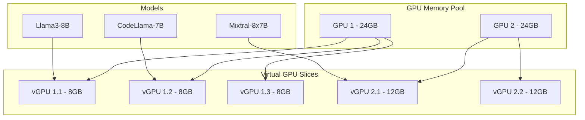
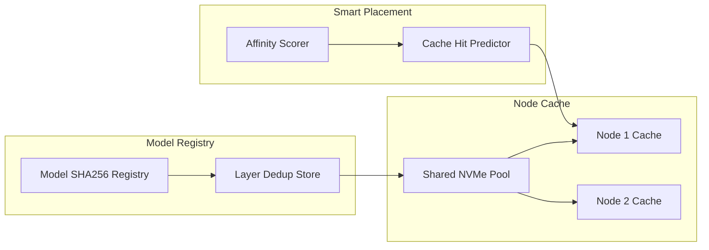
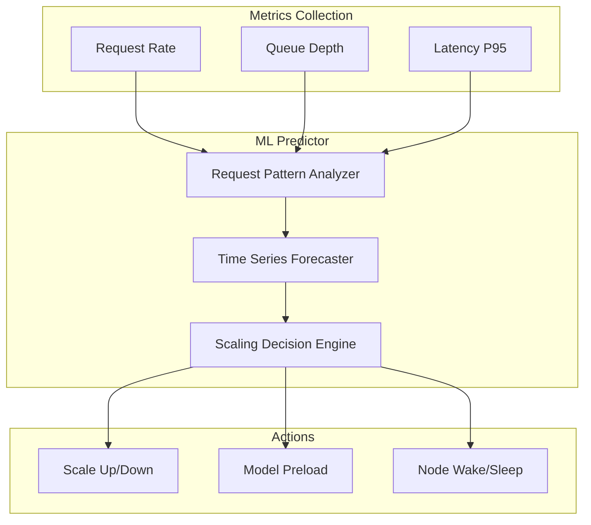
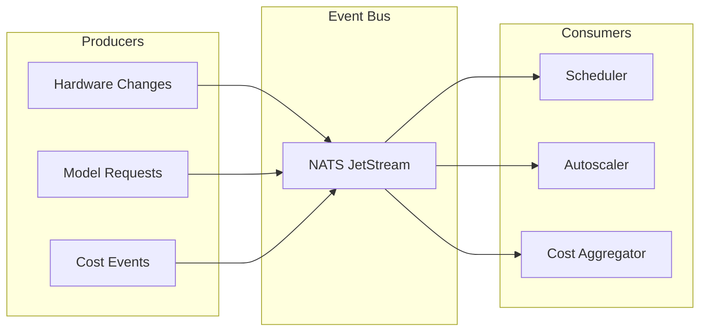
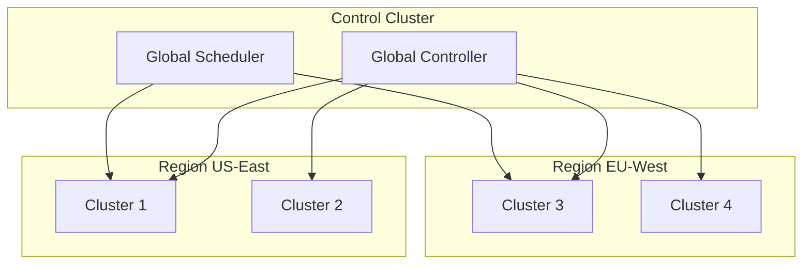
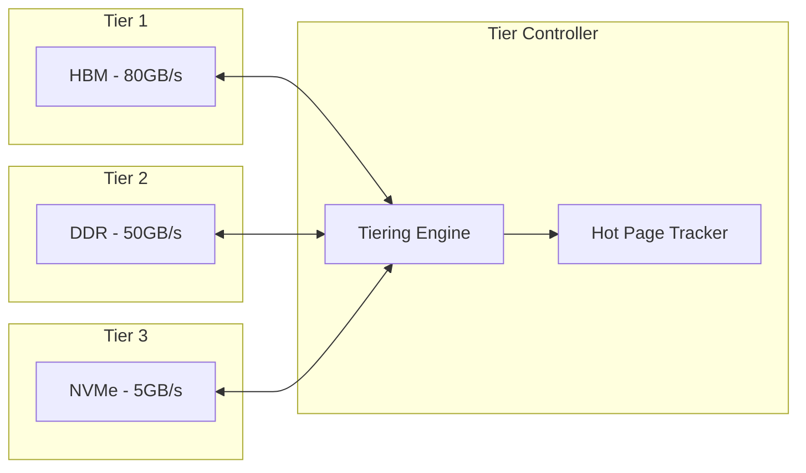

# FlexInfer Architectural Improvements and Feature Roadmap

## Executive Summary

This document outlines critical architectural improvements and innovative features for FlexInfer, a Kubernetes operator and scheduler plugin that intelligently routes LLM inference workloads across heterogeneous GPU infrastructure. Based on analysis of the current implementation, we've identified key gaps and propose transformative enhancements to position FlexInfer as a leading solution in the GPU orchestration space.

## 1. Current Implementation Gaps

### 1.1 Missing Core Kubernetes Features

#### Finalizers and Cleanup Logic
- **Gap**: No finalizers in [`ModelDeployment`](../api/v1alpha1/types.go) CRD
- **Impact**: Resources may leak when ModelDeployments are deleted
- **Priority**: HIGH

#### Limited Status Management
- **Gap**: Basic status in [`ModelDeploymentStatus`](../api/v1alpha1/types.go:60-70) with only conditions and TPS
- **Impact**: Poor observability and debugging capabilities
- **Priority**: HIGH

#### No GPU Resource Requests
- **Gap**: [`deploymentForModelDeployment`](../controllers/modeldeployment_controller.go:203-212) doesn't request GPU resources
- **Impact**: Pods can be scheduled on non-GPU nodes
- **Priority**: CRITICAL

#### Static Hardware Discovery
- **Gap**: [`ProbeAndLabel`](../agents/agent/agent.go:57) runs once without periodic refresh
- **Impact**: Hardware changes not detected (hot-swap, driver updates)
- **Priority**: MEDIUM

#### Missing Admission Webhooks
- **Gap**: No validation webhooks for ModelDeployment specs
- **Impact**: Invalid configurations accepted, runtime failures
- **Priority**: MEDIUM

### 1.2 Scalability Limitations

#### Single Controller Instance
- **Gap**: No leader election in [`main.go`](../cmd/flexinfer-manager/main.go)
- **Impact**: Cannot run multiple controller replicas for HA
- **Priority**: HIGH

#### No GPU Sharing
- **Gap**: One model per GPU, no fractional allocation
- **Impact**: Underutilized expensive GPU resources
- **Priority**: HIGH

## 2. Proposed Innovative Features

### 2.1 Dynamic GPU Sharing and Fractional Allocation



**Implementation**:
- Extend CRD with GPU fraction requests
- Implement GPU memory isolation using NVIDIA MIG or AMD MxGPU
- Dynamic slice resizing based on utilization

### 2.2 Real-time GPU Utilization and Cost Tracking

**Features**:
- Per-request GPU time tracking
- Cost allocation by namespace/team
- Real-time dashboards with Prometheus/Grafana
- Budget alerts and quotas

**New CRD Fields**:
```yaml
spec:
  costTracking:
    enabled: true
    pricePerGPUHour: 2.50
    billingTag: "ml-team-alpha"
status:
  metrics:
    totalGPUSeconds: 15420
    estimatedCost: 10.70
    carbonEmissions: 2.3 # kg CO2
```

### 2.3 Intelligent Model Caching with Deduplication



**Benefits**:
- 70% reduction in model download times
- Deduplicated storage across nodes
- Predictive pre-warming based on usage patterns

### 2.4 Multi-Model Serving on Single GPU

**Architecture**:
- Request router with model multiplexing
- Dynamic batching across models
- Memory-mapped model swapping
- Priority queues per model

### 2.5 Auto-scaling Based on Request Patterns



### 2.6 Carbon Footprint Tracking for Green AI

**Features**:
- Real-time power consumption monitoring
- Regional carbon intensity integration
- Green scheduling policies (prefer renewable energy regions)
- Sustainability reports and dashboards

### 2.7 FinOps Integration

**Integrations**:
- AWS Cost Explorer / Azure Cost Management
- Kubecost / OpenCost APIs
- Custom billing webhooks
- Chargeback/showback reports

## 3. Architectural Improvements

### 3.1 Event-Driven Architecture



### 3.2 Plugin System for Custom Backends

```go
type BackendPlugin interface {
    Name() string
    ValidateModel(model string) error
    GetRequiredResources(model string) ResourceRequirements
    GeneratePodSpec(deployment *ModelDeployment) corev1.PodSpec
    HealthCheck(endpoint string) error
}
```

**Built-in Plugins**:
- Ollama
- vLLM
- TensorRT-LLM
- Triton Inference Server

### 3.3 Federation Support for Multi-Cluster



### 3.4 Advanced Scheduling Algorithms

**ML-Based Scheduling**:
- Train on historical placement decisions
- Features: model size, GPU type, time of day, queue depth
- Online learning with bandit algorithms
- A/B testing framework for scheduler policies

### 3.5 GPU Memory Tiering



## 4. Implementation Roadmap

### Phase 1: Foundation (Months 1-2)
1. **Add finalizers and comprehensive status management**
   - Implement deletion webhooks
   - Expand status with detailed conditions
   - Add event recording

2. **Implement GPU resource requests**
   - Update pod specs with nvidia.com/gpu or amd.com/gpu
   - Add resource validation

3. **Enable leader election**
   - Add election support to controller manager
   - Test HA failover scenarios

### Phase 2: Core Features (Months 3-4)
1. **Dynamic hardware discovery**
   - Implement periodic refresh (configurable interval)
   - Add hardware change detection and events

2. **Admission webhooks**
   - Validate model existence
   - Check resource quotas
   - Enforce naming conventions

3. **Basic GPU sharing**
   - Time-slicing implementation
   - Simple fractional allocation

### Phase 3: Advanced Features (Months 5-6)
1. **Event-driven architecture**
   - Integrate NATS JetStream
   - Refactor to event sourcing

2. **Plugin system**
   - Define plugin API
   - Implement 2-3 reference plugins

3. **Cost tracking MVP**
   - Basic utilization metrics
   - Simple cost calculations

### Phase 4: Innovation (Months 7-9)
1. **ML-based scheduling**
   - Data collection pipeline
   - Initial model training
   - A/B testing framework

2. **Model caching system**
   - Deduplication engine
   - Distributed cache

3. **Multi-model serving**
   - Request router
   - Dynamic batching

### Phase 5: Enterprise Features (Months 10-12)
1. **Federation support**
   - Multi-cluster controller
   - Global scheduling policies

2. **Advanced FinOps**
   - Cloud provider integrations
   - Detailed reporting

3. **Carbon tracking**
   - Power monitoring
   - Green scheduling policies

## 5. Technical Debt Remediation

### Immediate Fixes
1. Add comprehensive error handling in controller
2. Implement proper context cancellation
3. Add retry logic with exponential backoff
4. Improve logging with structured fields
5. Add metrics for all operations

### Code Quality Improvements
1. Increase test coverage to 80%+
2. Add integration tests with envtest
3. Implement e2e tests with Kind
4. Add mutation tests
5. Set up continuous fuzzing

## 6. Success Metrics

### Technical Metrics
- GPU utilization: >85% average
- Model cache hit rate: >70%
- Scheduling latency: <100ms p99
- Resource waste: <10%

### Business Metrics
- Cost savings: 40% reduction in GPU spend
- Time to deploy: <5 minutes for new models
- Developer satisfaction: >4.5/5 rating
- Carbon reduction: 30% lower emissions

## 7. Risk Mitigation

### Technical Risks
- **GPU driver compatibility**: Maintain compatibility matrix
- **Performance overhead**: Keep overhead <5% with efficient implementation
- **Security concerns**: Regular security audits, RBAC policies

### Adoption Risks
- **Migration complexity**: Provide migration tools and guides
- **Learning curve**: Comprehensive documentation and training
- **Vendor lock-in**: Maintain open standards and interfaces

## Conclusion

These improvements will transform FlexInfer from a basic GPU scheduling solution into a comprehensive AI infrastructure platform. The phased approach ensures we deliver value quickly while building toward a transformative vision. By addressing current gaps and implementing innovative features, FlexInfer will become the de facto standard for GPU orchestration in Kubernetes environments.