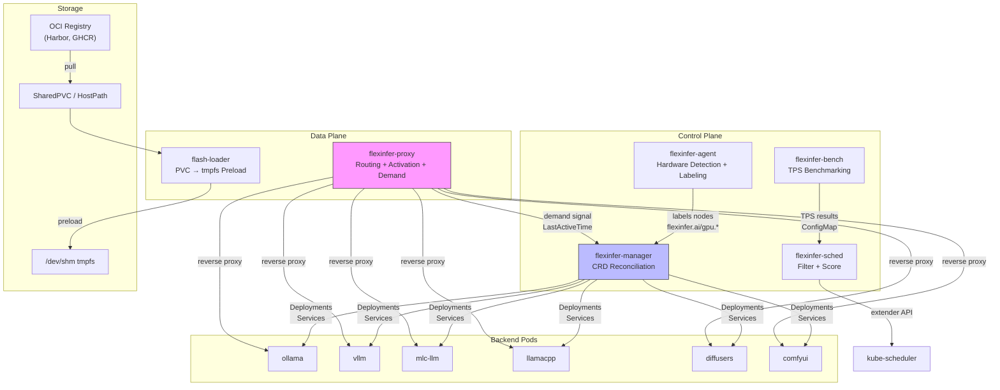
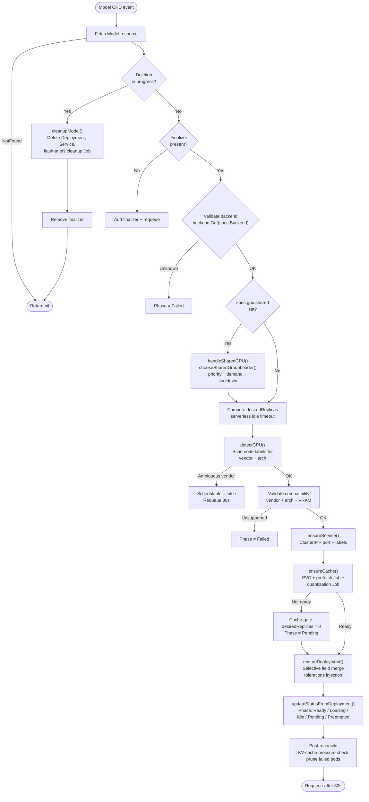
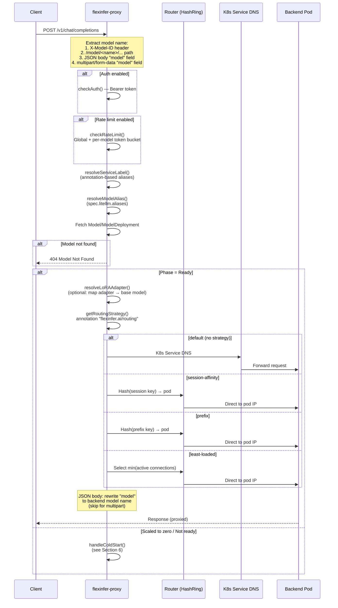
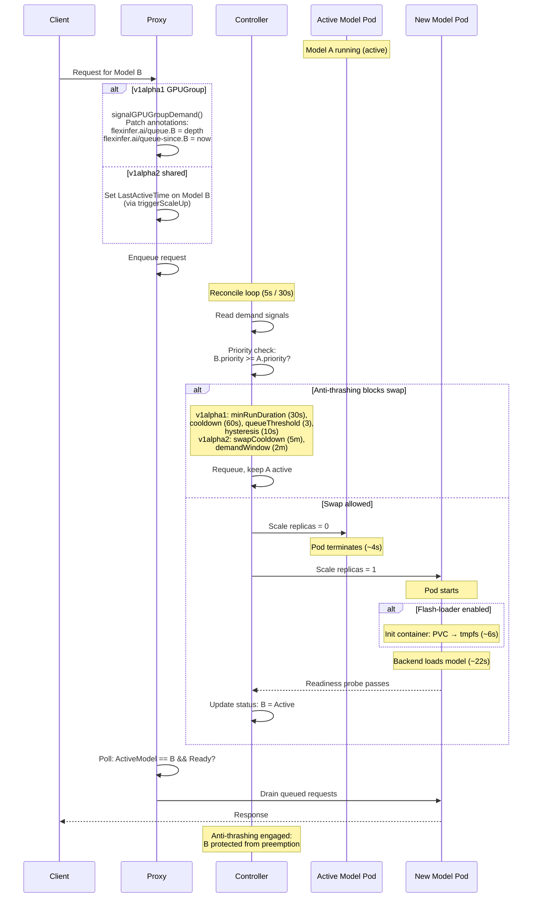
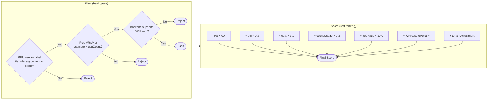
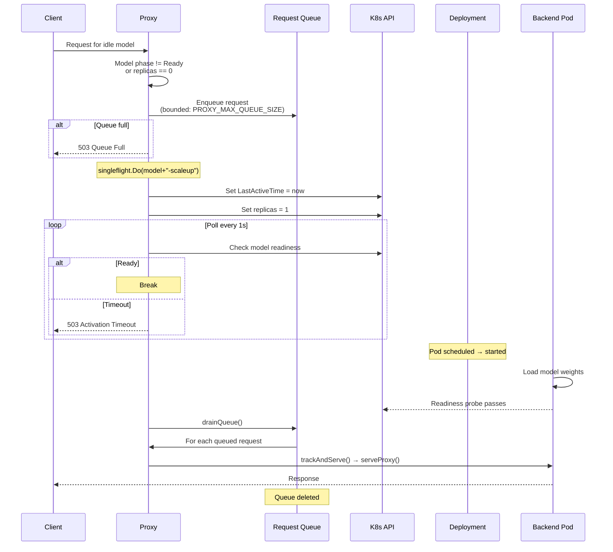

# Architecture

FlexInfer is a set of cooperating components:

- `flexinfer-agent`: node-level hardware discovery + labeling
- `flexinfer-manager`: Kubernetes controller manager (CRDs -> Deployments/Services)
- `flexinfer-sched`: scheduler extender (`/filter`, `/score`) for placement decisions
- `flexinfer-bench`: benchmark runner for tokens/sec measurement (v1alpha1 workflow)
- `flexinfer-proxy`: request router + scale-to-zero activator + GPU sharing demand signaling
- `flexinfer-flash-loader`: init-container sidecar for parallel model preloading (PVC -> tmpfs)

## CRDs

| API Version | Kind | Purpose |
|---|---|---|
| v1alpha2 | `Model` | Single-resource model lifecycle (recommended) |
| v1alpha2 | `LoRAAdapter` | Hot-swap LoRA adapters for vLLM |
| v1alpha2 | `ModelCatalog` | OCI model registry (Harbor, GHCR, ECR) |
| v1alpha2 | `Cluster` | Multi-cluster federation target |
| v1alpha2 | `FederatedModel` | Cross-cluster model placement |
| v1alpha2 | `GlobalProxy` | Federation-aware routing |
| v1alpha1 | `ModelDeployment` | Legacy per-deployment resource |
| v1alpha1 | `ModelCache` | Legacy cache management |
| v1alpha1 | `GPUGroup` | Explicit GPU sharing policies + anti-thrashing |

## Backend plugins

| Backend | Port | GPU | Notes |
|---|---|---|---|
| `ollama` | 11434 | NVIDIA, AMD | Downloads models on-demand |
| `vllm` | 8000 | NVIDIA, AMD | OpenAI-compatible, high throughput |
| `mlc-llm` | 8000 | NVIDIA, AMD | Pre-compiled, ROCm support |
| `llamacpp` | 8080 | NVIDIA, AMD, CPU | GGUF models, CPU/GPU hybrid |
| `diffusers` | 8000 | NVIDIA, AMD | Image generation (SD, FLUX) |
| `comfyui` | 8188 | NVIDIA, AMD | Workflow-based image generation |
| `vllm-omni` | 8000 | NVIDIA, AMD | Diffusion models with OpenAI API |

## Code layout

High-signal directories:

- `api/`: Go types for CRDs (source of schema)
- `controllers/`: reconciliation logic (model, gpugroup, modelcache)
- `backend/`: backend plugin registry (images/args/probes per backend)
- `scheduler/`: scheduler extender logic (filter + score)
- `internal/proxy/`: proxy routing, activation, rate limiting, connection tracking
- `agents/`: node agent + benchmarker implementations
- `pkg/registry/`: OCI registry adapters (Harbor, GHCR, ECR)
- `cmd/`: main packages for binaries

---

## 1. System overview



The agent labels GPU nodes with vendor, architecture, VRAM, and count. The controller reconciles `Model` CRDs into Deployments and Services. The scheduler extender biases pod placement using benchmark results and node annotations. The proxy routes requests, triggers scale-up for idle models, and signals demand for GPU sharing.

---

## 2. Controller reconciliation loop

The v1alpha2 `ModelReconciler` (`controllers/model_controller.go`) runs this flow on every `Model` CRD event:



### Key patterns

**Selective field merge**: The controller compares only the ~15 fields it manages (`deploymentManagedFieldChanges()`), ignoring K8s-defaulted fields like `revisionHistoryLimit`, `progressDeadlineSeconds`, and container `terminationMessagePath`. This prevents infinite update loops caused by API server defaults.

**Cache-gating**: `desiredReplicas` is forced to 0 until `ensureCache()` reports ready. The Deployment is created with `replicas=0`, and the phase stays `Pending` until cache prefetch/quantization jobs complete.

**Tolerations injection**: Two injection points:
1. Deployment pods get `dedicated=gpu:NoSchedule` when `gpuCount > 0`
2. Quantization jobs get the same toleration when `spec.quantize.useGPU == true`

**Nil-vs-empty normalization**: Pointer types like `SecurityContext` and `Affinity` use `podObjectEqual[T]()` to treat `nil` and `&{}` as equivalent, avoiding spurious updates.

---

## 3. Proxy request routing

The proxy (`internal/proxy/`) handles model extraction, routing strategy selection, and reverse-proxying to backend pods.



### Model extraction cascade

The proxy tries four sources in order (`resolver.go:extractModelNameAndBody()`):

1. `X-Model-ID` header
2. `/model/<name>/...` path prefix (stripped before forwarding)
3. JSON body `{ "model": "<name>" }` (POST + `application/json`)
4. Multipart form `"model"` field (POST + `multipart/form-data`)

For multipart requests (e.g., `/v1/images/edits`), the body is forwarded intact — no JSON model rewriting occurs. The `bodyBytes` return is `nil`, which signals the routing layer to skip the `rewriteModelInBody()` call.

### Routing strategies

| Strategy | Key source | Mechanism |
|---|---|---|
| default | — | K8s Service DNS (ClusterIP) |
| `session-affinity` | `X-Session-ID` > `X-Conversation-ID` > body `session_id` > SHA256(first 5 messages) | CRC32 hash ring (150 vnodes/pod) |
| `prefix` | `X-Flexinfer-Cache-Key` > body `cache_key` > canonical hash | CRC32 hash ring |
| `least-loaded` | active connection count | Select pod with fewest connections |

### Background goroutines

- **`watchEndpoints()`** (every 10s): Syncs ready pod IPs from K8s Endpoints into per-model hash rings. Excludes pods on spot-terminating nodes.
- **`cleanupStaleQueues()`** (every 30s): Removes empty queues older than `2 * queueTimeout`.

---

## 4. GPU sharing swap

FlexInfer supports two GPU sharing mechanisms. Both use one-active-at-a-time swapping with anti-thrashing.

### v1alpha2: `spec.gpu.shared` (model_controller.go)

Models sharing the same `gpu.shared` group name compete for a single GPU. The controller runs `handleSharedGPU()` → `chooseSharedGroupLeader()` on every reconcile.

### v1alpha1: `GPUGroup` CRD (gpugroup_controller.go)

The `GPUGroup` resource manages explicit groups with configurable anti-thrashing policies.

Both paths follow the same logical sequence:



### Anti-thrashing constants

| Mechanism | Parameter | v1alpha2 default | v1alpha1 default |
|---|---|---|---|
| Demand window | How long demand must persist | 2 min (`sharedDemandWindow`) | 10s (`HysteresisWindowSeconds`) |
| Queue threshold | Min queue depth before swap | 1 (any demand) | 3 (`RequestQueueThreshold`) |
| Swap cooldown | Post-swap protection | 5 min (`sharedSwapCooldown`) | 30s (`MinimumRunDurationSeconds`) |
| Preemption cooldown | After being preempted | — | 60s (`CooldownAfterPreemptionSeconds`) |
| Priority gate | Lower cannot preempt higher | `demandedPriority >= readyPriority` | Implicit in sort order |

### Observed swap latency (gfx1100, typical)

| Phase | Duration |
|---|---|
| Demand window + controller detect | ~5–10s |
| Pod termination (graceful) | ~4s |
| Flash-loader (if enabled) | ~6s |
| Model load (backend startup) | ~22s |
| First inference | ~15s |
| **Total (cold, no flash)** | ~45–60s |
| **Total (with flash-loader)** | ~35–50s |

---

## 5. Scheduler filter + score

The scheduler extender (`scheduler/scheduler.go`) provides `/filter` and `/score` endpoints called by `kube-scheduler`.



### Filter checks

| # | Check | Source | Failure reason |
|---|---|---|---|
| 1 | GPU vendor label exists | Node label `flexinfer.ai/gpu.vendor` | No vendor label |
| 2 | Free VRAM sufficient | Node annotation `flexinfer.ai/gpu-free-memory` vs pod annotation `flexinfer.ai/gpu.vram-estimate-mb` | Insufficient VRAM |
| 3 | Backend arch supported | `backend.LookupGPUArchSupport(backend, arch)` | Unsupported arch |

Checks 2 and 3 are conditional — they run only when the relevant annotations/labels are present.

### Score formula

```
score = tps × tpsWeight
      − util × utilWeight
      − cost × costWeight
      − cacheUsage × cacheWeight
      + freeRatio × vramFreeWeight
      − kvPressurePenalty
      + tenantAdjustment
```

### Score weights (configurable via env vars)

| Weight | Env var | Default | Effect |
|---|---|---|---|
| `tpsWeight` | `SCHED_TPS_WEIGHT` | **0.7** | Prefer faster nodes |
| `utilWeight` | `SCHED_UTIL_WEIGHT` | **0.2** | Avoid busy nodes |
| `costWeight` | `SCHED_COST_WEIGHT` | **0.1** | Prefer cheaper nodes |
| `cacheWeight` | `SCHED_CACHE_WEIGHT` | **0.3** | Avoid KV-cache-heavy nodes |
| `vramFreeWeight` | `SCHED_VRAM_FREE_WEIGHT` | **10.0** | Strongly prefer VRAM headroom |
| `tenantFairShareWeight` | `SCHED_TENANT_FAIRSHARE_WEIGHT` | **5.0** | Fair-share adjustment (optional) |

### KV-cache pressure penalty

When `cacheUsage > 0.85`, the penalty ramps linearly:

```
kvPressurePenalty = (cacheUsage − 0.85) × 20.0
```

This makes nodes with high KV-cache pressure increasingly unattractive.

### TPS lookup

Benchmark results are resolved in order:
1. Global ConfigMap keyed by `SHA256(backend|model|deviceClass)`
2. Per-deployment ConfigMap `md-benchmark-results` (key `tokensPerSecond`)
3. Falls back to `0.0`

---

## 6. Scale-to-zero activation

When a request arrives for a model with zero replicas, the proxy queues the request and triggers scale-up.



### Activation details

- **Singleflight**: `sync/singleflight.Group` deduplicates concurrent scale-up triggers for the same model. Only one goroutine patches the K8s resource.
- **Cold start timeout**: `max(PROXY_QUEUE_TIMEOUT, spec.serverless.coldStartTimeout)`, default 60s.
- **Backoff** (optional, `PROXY_BACKOFF_ENABLED`): Retries with exponential backoff and jitter on failed activation.
- **Connection tracking**: `trackAndServe()` increments an atomic counter + Prometheus gauge `active_connections{model}`. The proxy also updates `LastActiveTime` asynchronously (throttled to once per minute).
- **Idle scale-down**: The controller checks `time.Since(LastActiveTime) > idleTimeout` and sets `replicas = minReplicas` when the model is idle. Default idle timeout is 300s (5 min).

### Configuration

| Env var | Default | Purpose |
|---|---|---|
| `PROXY_MAX_QUEUE_SIZE` | 100 | Max queued requests per model |
| `PROXY_QUEUE_TIMEOUT` | 60s | Max wait time in queue |
| `PROXY_COLD_START_TIMEOUT` | 60s | Max wait for model readiness |
| `PROXY_BACKOFF_ENABLED` | false | Enable retry with exponential backoff |
| `PROXY_BACKOFF_MAX_RETRIES` | 3 | Max retry attempts |
