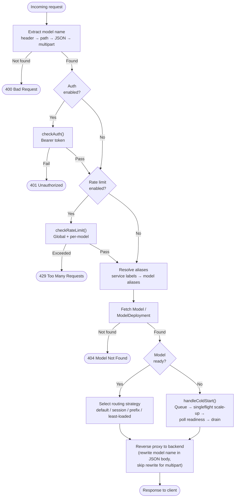

# Proxy API

Binary: `flexinfer-proxy` (`services/flexinfer/cmd/flexinfer-proxy`)

The proxy is intentionally small: it doesn’t define a new inference protocol. Instead, it:

- routes requests to backend services
- uses the `"model"` selection semantics common to OpenAI-compatible APIs
- queues during cold starts

Machine-readable OpenAPI spec:

- `services/flexinfer/specs/openapi/flexinfer-proxy.openapi.yaml`

## HTTP endpoints

### `GET /healthz`

Returns `200 ok` when the process is up.

### `GET /metrics`

Prometheus metrics for proxy queueing + activation behavior.

### `GET /v1/models`

OpenAI-compatible model listing. It aggregates:

- v1alpha1 `ModelDeployment` resources
- v1alpha2 `Model` resources

Response shape:

```json
{ "object": "list", "data": [ { "id": "llama3-8b", "object": "model", "created": 0, "owned_by": "flexinfer", "metadata": {} } ] }
```

### `/*` (reverse proxy)

All other paths are forwarded to the selected model backend (subject to scale-to-zero/activation).

## Model selection

The proxy extracts model name from (first match wins):

1. `X-Model-ID` header
2. `/model/<name>/...` path prefix (stripped before forwarding)
3. OpenAI JSON body `{ "model": "<name>" }` (POST + `application/json`)
4. Multipart form `"model"` field (POST + `multipart/form-data`, e.g., `/v1/images/edits`)

For multipart requests, the payload is forwarded intact to the backend — no JSON model rewriting occurs.

## Request flow



## Scale-to-zero contract

If a model has zero replicas (idle), the proxy may:

- enqueue the request (bounded by `PROXY_MAX_QUEUE_SIZE`)
- activate the model
- wait for readiness (bounded by `PROXY_QUEUE_TIMEOUT` / `PROXY_COLD_START_TIMEOUT`)

Configuration details live in `docs/CONFIGURATION.md`.
