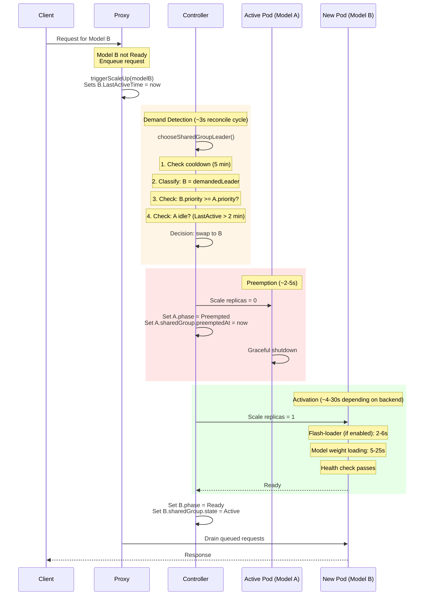
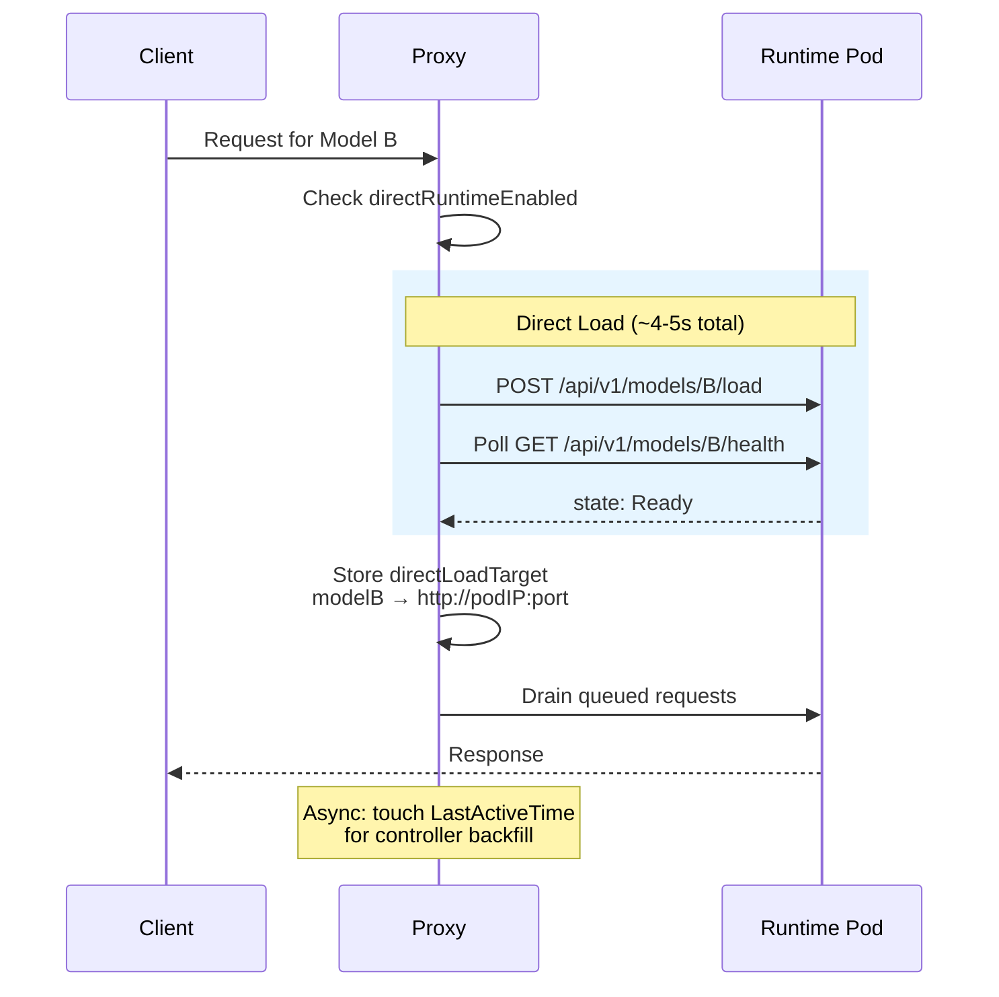

# GPU Sharing Runbook

## 1. Overview

FlexInfer GPU sharing enables multiple models to time-share a single GPU. Only one model runs at a time. The controller uses priority-based leader election to decide which model holds the GPU, and the proxy signals demand when requests arrive for an inactive model.

Use GPU sharing when:

- You have a single GPU and multiple models that are not used simultaneously.
- You want automatic preemption so high-priority workloads always get the GPU.
- You want serverless scale-to-zero with on-demand activation for secondary models.

GPU sharing is configured via `spec.gpu.shared` on the v1alpha2 `Model` resource. Models with the same `shared` value form a shared group.

## 2. Concepts

### SharedGroup

A shared group is an implicit collection of `Model` resources that share the same `spec.gpu.shared` string value. The controller discovers group members by listing all models in the namespace and filtering by this field. There is no separate CRD for the group itself.

```
Source: api/v1alpha2/model_types.go, line 317 (GPUSpec.Shared field)
Source: controllers/model_shared_gpu.go, lines 239-253 (group discovery)
```

### Priority

Each model has an integer priority (0-1000, default 100). Higher values win. The controller evaluates priority during leader election to determine which model gets the GPU.

Key rule: a demanded model can only preempt the current active model if `demandedPriority >= readyPriority`. A lower-priority model cannot preempt a higher-priority one, even with active demand.

```
Source: controllers/model_shared_gpu.go, line 146
```

### Demand Window

The proxy sets `model.Status.LastActiveTime` when a request arrives for an inactive model. The controller considers this a demand signal if it falls within the **2-minute demand window** (`sharedDemandWindow`). After 2 minutes without a new request, the demand signal expires.

```
Source: controllers/model_shared_gpu.go, line 41
```

### Swap Cooldown

After a preemption, the controller blocks further demand-based swaps for **5 minutes** (`sharedSwapCooldown`). This prevents thrashing when two models receive alternating requests. The cooldown uses the **maximum** `spec.gpu.swapCooldown` value across all models in the group.

```
Source: controllers/model_shared_gpu.go, lines 43-46, 87-94
```

### Leader Election

The controller runs `chooseSharedGroupLeader()` every 3 seconds (`requeueFast`) for each shared group. The algorithm proceeds in four stages:

1. **Anti-thrashing gate** -- If any model has a `PreemptedAt` timestamp within the cooldown window, the current `Active` model keeps its position.
2. **Classification** -- Models are classified into: `readyLeader` (Phase=Ready), `demandedLeader` (LastActiveTime within 2 min), `recentLeader` (LastActiveTime within 5 min), `warmPrimaryLeader` (config `warmPolicy=primary`), and `fallbackLeader` (any model).
3. **Demand-based preemption** -- If a demanded model exists, the ready leader is idle (LastActiveTime > 2 min or nil), and the demanded model's priority >= the ready model's priority, the swap triggers.
4. **Fallback chain** -- `readyLeader` > `recentLeader` > `warmPrimaryLeader` > `fallbackLeader`.

Within each category, ties break by: highest priority, then most recent LastActiveTime, then alphabetical name.

### Model Phases in Shared Groups

| Phase | Meaning |
|-------|---------|
| `Ready` | Model is loaded and serving requests |
| `Preempted` | Model was evicted by a higher-priority model |
| `Idle` | Model scaled to zero (serverless idle timeout) |
| `Pending` | Model is waiting to be scheduled |
| `Loading` | Backend container is starting |
| `Failed` | Model failed to load |

### Warm Primary Policy

A model with `config: {"warmPolicy": "primary"}` receives preferential treatment in the fallback chain. When no model is Ready and no demand signal exists, the warm primary model starts first. This is useful for designating a default model that should be running when no other demand exists.

## 3. Configuration

### Basic Shared Group (Two Models)

```yaml
apiVersion: ai.flexinfer/v1alpha2
kind: Model
metadata:
  name: imagegen
  namespace: flexinfer-system
spec:
  backend: diffusers
  source: HF://black-forest-labs/FLUX.1-schnell
  gpu:
    shared: my-gpu-group    # Group identifier (arbitrary string)
    priority: 200           # Higher = more important
  serverless:
    idleTimeout: "5m"
  serviceLabels:
    - image-gen
    - text-to-image
---
apiVersion: ai.flexinfer/v1alpha2
kind: Model
metadata:
  name: textgen
  namespace: flexinfer-system
spec:
  backend: vllm
  source: HF://Qwen/Qwen3-14B-AWQ
  gpu:
    shared: my-gpu-group    # Same group as imagegen
    priority: 150           # Yields to imagegen
  serverless:
    idleTimeout: "5m"
  serviceLabels:
    - textgen
    - code
```

### Custom Swap Cooldown

Override the default 5-minute anti-thrashing cooldown per model. The controller uses the **maximum** value across the group.

```yaml
spec:
  gpu:
    shared: my-gpu-group
    priority: 100
    swapCooldown: "3m"      # Smaller models load faster, allow quicker swaps
```

### Warm Primary Model

Designate a model that starts by default when no demand exists.

```yaml
spec:
  gpu:
    shared: my-gpu-group
    priority: 100
  config:
    warmPolicy: primary     # Starts first when no other model has demand
```

### VRAM Estimate for Scheduling

```yaml
spec:
  gpu:
    shared: my-gpu-group
    priority: 100
    vramEstimateMB: 16000   # Used for scheduling decisions
```

### Cache Strategy for Fast Swaps

Combine GPU sharing with caching to minimize swap latency.

```yaml
spec:
  gpu:
    shared: my-gpu-group
    priority: 100
  cache:
    strategy: SharedPVC       # Keep weights on persistent volume
    pvcName: model-cache-pvc
    flashLoader:
      enabled: true           # Parallel-copy from PVC to tmpfs on startup
      concurrency: 4
```

## 4. Priority and Preemption

### Priority Rules

| Scenario | Outcome |
|----------|---------|
| Model A (priority=200, Ready, idle) vs Model B (priority=150, demand) | A stays -- B cannot preempt because 150 < 200 |
| Model A (priority=100, Ready, idle) vs Model B (priority=150, demand) | B wins -- demanded priority (150) >= ready priority (100) |
| Model A (priority=100, Ready, active) vs Model B (priority=100, demand) | A stays -- A is not idle (LastActiveTime within 2 min) |
| Model A (priority=100, Ready, idle) vs Model B (priority=100, demand) | B wins -- equal priority, A is idle, B has demand |
| Model A (priority=200, Ready) vs Model B (priority=300, demand), cooldown active | A stays -- cooldown blocks all swaps |

### Worked Example: Imagegen + Textgen

Setup:
- `imagegen`: priority=200 (primary model, image generation)
- `textgen`: priority=150 (secondary model, text generation)

Timeline:

1. **T=0** -- No requests. `imagegen` has `warmPolicy: primary`. Controller starts `imagegen`.
2. **T=5m** -- `imagegen` goes idle (no requests for 5 min). Scales to zero.
3. **T=6m** -- Chat request arrives for `textgen`. Proxy sets `textgen.LastActiveTime = now`. Controller sees demand, no ready model exists, starts `textgen`.
4. **T=6m30s** -- `textgen` reaches Ready. Serves chat requests.
5. **T=9m** -- Image request arrives for `imagegen`. Proxy sets `imagegen.LastActiveTime = now`. Controller evaluates: `demandedPriority(200) >= readyPriority(150)` AND `textgen` is idle (no recent requests). **Swap triggers.** `textgen` is preempted. `imagegen` starts loading.
6. **T=9m30s** -- `imagegen` reaches Ready. Serves image request.
7. **T=10m** -- Another chat request arrives for `textgen`. Proxy sets demand. But cooldown is active (preemption at T=9m, cooldown = 5 min). **Swap blocked until T=14m.**
8. **T=14m** -- Cooldown expires. If `textgen` still has demand and `imagegen` is idle, swap can happen. But `textgen` priority (150) < `imagegen` priority (200), so swap is **blocked by priority gate**.
9. **T=14m** -- `imagegen` goes idle. Scales to zero via idle timeout. `textgen` becomes fallback leader. Next chat request starts `textgen`.

## 5. Timing Diagram

### Full Swap Cycle



### Direct Runtime Fast Path

When enabled, the proxy bypasses the controller reconcile loop for faster activation.



## 6. Hot-Swap Latency Breakdown

| Phase | Typical Duration | Description |
|-------|-----------------|-------------|
| Demand detection | 0-3s | Controller reconcile cycle (`requeueFast = 3s`) |
| Priority + cooldown check | <1ms | In-memory computation |
| Preemption (scale down) | 2-5s | Graceful shutdown of active pod |
| Pod scheduling | 1-3s | Kubernetes scheduler assigns node |
| Image pull | 0s (cached) / 20-30min (first pull) | Container image pull from registry |
| Flash-loader init | 2-6s | Parallel copy from PVC/hostPath to tmpfs (if enabled) |
| Model weight loading | 5-25s | Backend loads weights into GPU VRAM |
| Health check pass | 1-2s | Readiness probe passes |
| Queue drain | <1s | Proxy forwards buffered requests |
| **Total (warm cache)** | **~10-35s** | All images cached, weights on PVC |
| **Total (direct load)** | **~4-5s** | Direct runtime fast path (ollama/llamacpp) |

These numbers are from production observations on AMD gfx1100 (7900 XTX). NVIDIA GPUs may differ. Large diffusers models (FLUX, SDXL) take 20-30s for weight loading. Smaller LLMs (ollama, llamacpp) load in 3-8s.

## 7. Operational Procedures

### 7.1 Inspect Shared Group State

View all models in a shared group with their state, priority, and queue position.

```bash
kubectl get models -n flexinfer-system -o custom-columns=\
  NAME:.metadata.name,\
  SHARED:.spec.gpu.shared,\
  PRIORITY:.spec.gpu.priority,\
  PHASE:.status.phase,\
  STATE:.status.sharedGroup.state,\
  QUEUE:.status.sharedGroup.queuePosition,\
  PREEMPTED_BY:.status.sharedGroup.preemptedBy,\
  LAST_ACTIVE:.status.lastActiveTime
```

Expected output:

```
NAME       SHARED              PRIORITY   PHASE       STATE    QUEUE   PREEMPTED_BY   LAST_ACTIVE
imagegen   5930k-imagegen      200        Ready       Active   0                      2026-03-21T10:15:00Z
textgen    5930k-imagegen      150        Preempted   Queued   1       imagegen       2026-03-21T10:10:00Z
```

### 7.2 Scale Up a Shared Model Manually

Force a specific model to become the active leader by patching its `LastActiveTime`.

```bash
# Set demand signal on the target model
kubectl patch model textgen -n flexinfer-system \
  --type=merge --subresource=status \
  -p '{"status":{"lastActiveTime":"'"$(date -u +%Y-%m-%dT%H:%M:%SZ)"'"}}'
```

Verify the swap is progressing:

```bash
# Watch for state changes (poll every 3s)
kubectl get model textgen -n flexinfer-system -w \
  -o custom-columns=NAME:.metadata.name,PHASE:.status.phase,STATE:.status.sharedGroup.state
```

If the cooldown is blocking the swap, check when it expires:

```bash
kubectl get models -n flexinfer-system \
  -o jsonpath='{range .items[*]}{.metadata.name}{"\t"}{.status.sharedGroup.preemptedAt}{"\n"}{end}'
```

### 7.3 Safe Rollout Restart (Avoid Deadlock)

**WARNING:** Do not `kubectl rollout restart` an Active shared-group model directly. The restart causes the model to lose Ready status, which triggers leader re-election. If no other model is Ready, both models can deadlock at 0 replicas.

Safe procedure:

```bash
# 1. Identify the active model
ACTIVE=$(kubectl get models -n flexinfer-system \
  -o jsonpath='{range .items[?(@.status.sharedGroup.state=="Active")]}{.metadata.name}{end}')
echo "Active model: $ACTIVE"

# 2. Scale up a secondary model first (so something is Ready after restart)
kubectl patch model <secondary-model> -n flexinfer-system \
  --type=merge --subresource=status \
  -p '{"status":{"lastActiveTime":"'"$(date -u +%Y-%m-%dT%H:%M:%SZ)"'"}}'

# 3. Wait for the secondary model to reach Ready
kubectl wait model <secondary-model> -n flexinfer-system \
  --for=jsonpath='{.status.phase}'=Ready --timeout=120s

# 4. Now it is safe to update the original model (e.g., image update)
kubectl set image deployment/$ACTIVE -n flexinfer-system \
  $ACTIVE=registry.harbor.lan/flexinfer/$ACTIVE:new-tag

# 5. If the original model should be active again, send a request to re-trigger demand
curl http://flexinfer-proxy.flexinfer-system/model/$ACTIVE/v1/chat/completions \
  -H "Content-Type: application/json" \
  -d '{"model":"'"$ACTIVE"'","messages":[{"role":"user","content":"ping"}]}'
```

### 7.4 Force a Model Swap

Bypass cooldown by clearing the `PreemptedAt` timestamp, then signaling demand.

```bash
# 1. Clear preemption timestamps across the group
for model in imagegen textgen; do
  kubectl patch model "$model" -n flexinfer-system \
    --type=json --subresource=status \
    -p '[{"op":"remove","path":"/status/sharedGroup/preemptedAt"}]' 2>/dev/null || true
done

# 2. Signal demand for the target model
kubectl patch model textgen -n flexinfer-system \
  --type=merge --subresource=status \
  -p '{"status":{"lastActiveTime":"'"$(date -u +%Y-%m-%dT%H:%M:%SZ)"'"}}'

# 3. Monitor the swap
kubectl get models -n flexinfer-system -w \
  -o custom-columns=NAME:.metadata.name,PHASE:.status.phase,STATE:.status.sharedGroup.state
```

### 7.5 Clear Stale tmpfs

Flash-loader uses `/dev/shm/flexinfer/{namespace}/{model-name}` as a tmpfs cache. If a pod crashes or is evicted, stale files may remain and block the next flash-loader init container.

```bash
# SSH to the GPU node
ssh cblevins@<gpu-node>

# List stale flash-loader caches
ls -la /dev/shm/flexinfer/

# Remove stale cache for a specific model
sudo rm -rf /dev/shm/flexinfer/flexinfer-system/<model-name>

# Or clear all flash-loader caches on this node
sudo rm -rf /dev/shm/flexinfer/
```

Note: The controller's cleanup jobs require `dedicated=gpu:NoSchedule` toleration to schedule on tainted GPU nodes.

### 7.6 Run the Swap Benchmark

FlexInfer includes a swap latency benchmark script.

```bash
# Run all benchmark phases
./scripts/bench-image-swap.sh

# Run specific phases
./scripts/bench-image-swap.sh warm       # Phase 1: warm inference latency
./scripts/bench-image-swap.sh cold       # Phase 2: cold-start swap
./scripts/bench-image-swap.sh swapback   # Phase 3: swap back to original
./scripts/bench-image-swap.sh burst      # Phase 4: concurrent burst during swap
```

Output:
- Report: `/tmp/bench-image-swap-report.md`
- ConfigMap: `flexinfer-swap-bench-results` in `flexinfer-system`

## 8. Troubleshooting

### 8.1 Both Models at 0 Replicas (Deadlock)

**Symptoms:**
- All models in a shared group show Phase=Preempted or Phase=Idle.
- No model has State=Active.
- Requests time out with 503.

**Root cause:** A rollout restart or failed pod caused the Active model to lose Ready status. Leader election found no Ready model, and the fallback logic could not start a model because no demand signal existed.

**Resolution:**

```bash
# 1. Identify the group and models
kubectl get models -n flexinfer-system -o custom-columns=\
  NAME:.metadata.name,SHARED:.spec.gpu.shared,PHASE:.status.phase,STATE:.status.sharedGroup.state

# 2. Send a request through the proxy to trigger demand signal
curl -X POST http://flexinfer-proxy.flexinfer-system/model/<model-name>/v1/chat/completions \
  -H "Content-Type: application/json" \
  -d '{"model":"<model-name>","messages":[{"role":"user","content":"ping"}]}'

# 3. Or manually set LastActiveTime on the desired model
kubectl patch model <model-name> -n flexinfer-system \
  --type=merge --subresource=status \
  -p '{"status":{"lastActiveTime":"'"$(date -u +%Y-%m-%dT%H:%M:%SZ)"'"}}'

# 4. Verify recovery
kubectl get model <model-name> -n flexinfer-system -w \
  -o custom-columns=NAME:.metadata.name,PHASE:.status.phase,STATE:.status.sharedGroup.state
```

**Prevention:** Always follow the safe rollout restart procedure in Section 7.3.

### 8.2 Swap Thrashing (Rapid Back-and-Forth)

**Symptoms:**
- Models swap every few minutes.
- `flexinfer_sharedgroup_preemptions_total` counter increases rapidly.
- High GPU utilization from repeated model loading, low utilization from inference.

**Root cause:** Two models at equal (or similar) priority both receiving requests within the 2-minute demand window, and the swap cooldown is too low.

**Resolution:**

```bash
# 1. Check preemption frequency
kubectl get models -n flexinfer-system \
  -o jsonpath='{range .items[*]}{.metadata.name}{"\t"}{.status.sharedGroup.preemptedAt}{"\n"}{end}'

# 2. Increase swap cooldown on both models
kubectl patch model imagegen -n flexinfer-system --type=merge \
  -p '{"spec":{"gpu":{"swapCooldown":"10m"}}}'
kubectl patch model textgen -n flexinfer-system --type=merge \
  -p '{"spec":{"gpu":{"swapCooldown":"10m"}}}'

# 3. Or differentiate priorities so one model is clearly preferred
kubectl patch model imagegen -n flexinfer-system --type=merge \
  -p '{"spec":{"gpu":{"priority":200}}}'
kubectl patch model textgen -n flexinfer-system --type=merge \
  -p '{"spec":{"gpu":{"priority":100}}}'
```

### 8.3 directLoadTargets Lost After Proxy Restart

**Symptoms:**
- Models that were loaded via the direct runtime fast path stop responding after a proxy pod restart.
- First request after proxy restart triggers a full cold start instead of instant routing.

**Root cause:** `directLoadTargets` is an in-memory `sync.Map` in the proxy. It is not persisted. After a proxy restart, all direct load routing entries are lost.

**Resolution:**

This is expected behavior. The next request for each model re-triggers the activation path (either direct load or controller-based). No manual intervention is needed unless the request times out.

```bash
# Check if the proxy restarted recently
kubectl get pods -n flexinfer-system -l app=flexinfer-proxy \
  -o custom-columns=NAME:.metadata.name,RESTARTS:.status.containerStatuses[0].restartCount,AGE:.metadata.creationTimestamp

# If models are stuck, send a request to re-trigger activation
curl http://flexinfer-proxy.flexinfer-system/model/<model-name>/v1/chat/completions \
  -H "Content-Type: application/json" \
  -d '{"model":"<model-name>","messages":[{"role":"user","content":"ping"}]}'
```

### 8.4 Demand Signal Expiring Before Model Loads

**Symptoms:**
- A request arrives for an inactive model, but the swap never completes.
- The model's `LastActiveTime` is more than 2 minutes old.
- Controller logs show no demand detected.

**Root cause:** The proxy sets `LastActiveTime` only once per scale-up attempt. If the active model does not go idle within 2 minutes, the demand signal expires. A new request is needed to re-signal demand.

**Resolution:**

```bash
# 1. Check LastActiveTime for the demanded model
kubectl get model <model-name> -n flexinfer-system \
  -o jsonpath='{.status.lastActiveTime}'

# 2. Check if the active model is truly idle
ACTIVE=$(kubectl get models -n flexinfer-system \
  -o jsonpath='{range .items[?(@.status.sharedGroup.state=="Active")]}{.metadata.name}{": "}{.status.lastActiveTime}{"\n"}{end}')
echo "$ACTIVE"

# 3. If the demand signal expired, send another request to re-signal
curl http://flexinfer-proxy.flexinfer-system/model/<model-name>/v1/chat/completions \
  -H "Content-Type: application/json" \
  -d '{"model":"<model-name>","messages":[{"role":"user","content":"ping"}]}'

# 4. If the active model will never go idle, consider raising the
#    demanded model's priority above the active model's priority
```

### 8.5 Lower-Priority Model Never Activates

**Symptoms:**
- A model with priority 100 never becomes Active despite receiving requests.
- A model with priority 200 holds the GPU even when idle.

**Root cause:** By design, `demandedPriority >= readyPriority` is required. A lower-priority model cannot preempt a higher-priority one.

**Resolution options:**

1. **Raise the lower model's priority** to match or exceed the active model's.
2. **Wait for idle timeout.** When the higher-priority model scales to zero via `spec.serverless.idleTimeout`, the lower-priority model becomes the fallback leader and starts on the next request.
3. **Manually scale down the active model:**

```bash
kubectl scale deployment <active-model> -n flexinfer-system --replicas=0
```

### 8.6 Service Labels Not Routing to Active Model

**Symptoms:**
- Requests using service labels (e.g., `image-gen`) return 404 or route to the wrong model.

**Root cause:** The controller syncs the `ai.flexinfer/active-services` annotation on each model's Service. Active models get their `serviceLabels` written into this annotation; inactive models get an empty string. If the annotation is stale, the proxy routes incorrectly.

**Resolution:**

```bash
# Check the annotation on each service in the group
for model in imagegen textgen; do
  echo -n "$model: "
  kubectl get svc "$model" -n flexinfer-system \
    -o jsonpath='{.metadata.annotations.ai\.flexinfer/active-services}'
  echo
done

# The active model should show its service labels (e.g., "image-gen,text-to-image")
# Inactive models should show an empty string

# If stale, trigger a reconcile by patching the model
kubectl annotate model imagegen -n flexinfer-system \
  flexinfer.ai/force-reconcile="$(date +%s)" --overwrite
```

## 9. Monitoring

### Prometheus Metrics

FlexInfer exposes shared-group metrics via the controller's `/metrics` endpoint.

| Metric | Type | Labels | Description |
|--------|------|--------|-------------|
| `flexinfer_sharedgroup_state` | Gauge | group, model, namespace, state | Current state of each model (1 = current state, 0 otherwise). States: Active, Queued, Preempted. |
| `flexinfer_sharedgroup_preemptions_total` | Counter | group, namespace, from, to | Total preemption events. `from` = preempted model, `to` = new active model. |
| `flexinfer_model_swap_duration_seconds` | Histogram | model, namespace, backend, group | Time from preemption to Ready for swap-in. Buckets: 0.25s to 120s. |
| `flexinfer_model_cold_start_duration_seconds` | Histogram | model, namespace, backend, cache_strategy | Time from activation to Ready. |
| `flexinfer_model_phase` | Gauge | model, namespace, phase | Current model phase (1 = active phase). |
| `flexinfer_model_transitions_total` | Counter | model, namespace, from, to, reason | Phase transition count. |

```
Source: pkg/metrics/exporter.go, lines 308-325
```

### Key Alerts

**Shared group deadlock** (both models at 0 replicas):

```promql
# Alert if no model in a shared group has state=Active for >5 minutes
max by (group, namespace) (flexinfer_sharedgroup_state{state="Active"}) == 0
```

**Excessive swap thrashing:**

```promql
# Alert if preemptions exceed 6/hour for a group
rate(flexinfer_sharedgroup_preemptions_total[1h]) > 0.1
```

**Swap latency degradation:**

```promql
# Alert if swap-in takes more than 60 seconds (p95)
histogram_quantile(0.95, rate(flexinfer_model_swap_duration_seconds_bucket[1h])) > 60
```

### Grafana Dashboard Queries

**Active model per group:**

```promql
flexinfer_sharedgroup_state{state="Active"} == 1
```

**Swap frequency over time:**

```promql
rate(flexinfer_sharedgroup_preemptions_total[5m])
```

**Model swap-in latency (p50, p95, p99):**

```promql
histogram_quantile(0.50, rate(flexinfer_model_swap_duration_seconds_bucket[1h]))
histogram_quantile(0.95, rate(flexinfer_model_swap_duration_seconds_bucket[1h]))
histogram_quantile(0.99, rate(flexinfer_model_swap_duration_seconds_bucket[1h]))
```
