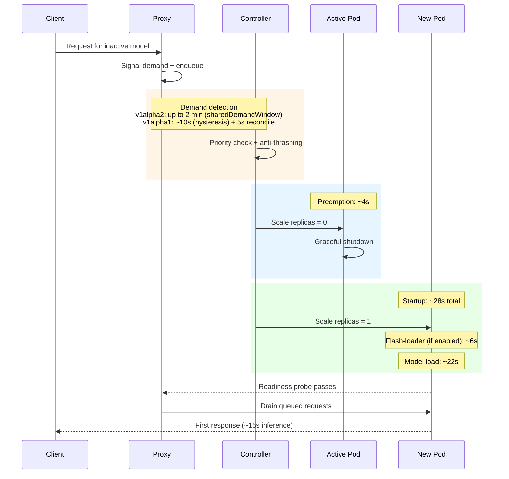

# GPU sharing

FlexInfer supports two GPU-sharing models:

- **v1alpha2**: `Model.spec.gpu.shared` (simple, homelab-friendly)
- **v1alpha1**: `GPUGroup` (explicit policies + anti-thrashing)

## v1alpha2: `spec.gpu.shared`

Models with the same `shared` value compete for the same GPU. Higher priority wins.

```yaml
apiVersion: ai.flexinfer/v1alpha2
kind: Model
metadata:
  name: qwen3-8b
spec:
  backend: mlc-llm
  source: HF://mlc-ai/Qwen3-8B-q4f16_1-MLC
  gpu:
    shared: homelab-gpu
    priority: 100
```

## v1alpha1: `GPUGroup`

`GPUGroup` enables:

- one-active-at-a-time swapping
- anti-thrashing controls
- proxy-driven demand signaling based on real queued requests

See:

- `services/flexinfer/examples/gpugroup-multi-model.yaml`
- `docs/DEPLOYMENT_RUNBOOK.md` (operational notes)

## Practical guidance

- Use `shared`/`GPUGroup` when you have one GPU and multiple “sometimes” models.
- Set priorities to encode “what should win” when demand arrives.
- When possible, combine GPU sharing with caching (`Memory` or `SharedPVC`) to reduce swap latency.

## Swap timing

When a request arrives for an inactive model, the proxy signals demand and the controller orchestrates a swap. The sequence below shows the phases and their typical durations:



### Timing constants

| Parameter | v1alpha2 default | v1alpha1 default | Configurable |
|---|---|---|---|
| Demand window | 2 min | 10s (hysteresis) | v1alpha1: `HysteresisWindowSeconds` |
| Queue threshold | 1 (any demand) | 3 requests | v1alpha1: `RequestQueueThreshold` |
| Swap cooldown | 5 min | 30s | v1alpha1: `MinimumRunDurationSeconds` |
| Preemption cooldown | — | 60s | v1alpha1: `CooldownAfterPreemptionSeconds` |
| Drain timeout | — | 60s | v1alpha1: `DrainTimeoutSeconds` |
| Idle timeout | `spec.serverless.idleTimeout` | 300s | v1alpha1: `IdleTimeoutSeconds` |

### Priority semantics

Higher `priority` values win. A model can only preempt the current active model if its priority is equal to or greater than the active model's priority. Lower-priority models must wait for the active model to go idle.

For v1alpha2 (`spec.gpu.shared`):
- The controller evaluates `demandedPriority >= readyPriority` explicitly in `chooseSharedGroupLeader()`.

For v1alpha1 (`GPUGroup`):
- Priority is encoded in the sort order of `determineActiveModel()`: models with demand are sorted by `priority DESC`, so the highest-priority model with queued requests always wins.

### Reducing swap latency

1. **Flash-loader**: Enable `spec.cache.strategy: Memory` to preload model files from PVC to `/dev/shm` tmpfs via an init container. Saves ~22s of disk I/O on swap.
2. **SharedPVC caching**: Use `spec.cache.strategy: SharedPVC` to keep model files on a persistent volume. Avoids re-downloading on every swap.
3. **Anti-thrashing tuning**: For latency-sensitive workloads, reduce `CooldownAfterPreemptionSeconds` and `MinimumRunDurationSeconds` (v1alpha1) or accept the v1alpha2 defaults.

## Operations Guide

### Inspecting Shared Group State

Check which model is active, queue positions, and priorities:

```bash
kubectl get models -n flexinfer-system -o custom-columns=\
  NAME:.metadata.name,\
  SHARED:.spec.gpu.shared,\
  PRIORITY:.spec.gpu.priority,\
  PHASE:.status.phase,\
  STATE:.status.sharedGroup.state,\
  QUEUE:.status.sharedGroup.queuePosition,\
  LAST_ACTIVE:.status.lastActiveTime
```

### Leader Election Algorithm (v1alpha2)

The controller runs `chooseSharedGroupLeader()` on every reconcile (~3 seconds) for each shared group. The algorithm has four stages:

**Stage 1 — Anti-thrashing check:**
If any model in the group has a `PreemptedAt` timestamp within the cooldown window (default 5 min, configurable via `spec.gpu.swapCooldown`), the current Active model keeps its position regardless of demand or priority. The cooldown is the **maximum** `swapCooldown` across all models in the group.

**Stage 2 — Classify models:**
Each model is classified into one or more categories:

| Category | Criteria | Purpose |
|----------|----------|---------|
| `readyLeader` | Phase = Ready | Model currently loaded and serving |
| `recentLeader` | LastActiveTime within 5 min | Recently active, may still be warm |
| `demandedLeader` | LastActiveTime within 2 min | Proxy signaled active demand |
| `fallbackLeader` | Any model | Last resort if no other category matches |

Within each category, ties are broken by: highest priority → most recent LastActiveTime → alphabetical name.

**Stage 3 — Demand-based preemption:**
If a `demandedLeader` exists **and** the `readyLeader` is idle (LastActiveTime > 2 min or nil) **and** `demandedPriority >= readyPriority`, the demanded model wins. This is the only path where a swap can happen.

**Stage 4 — Fallback:**
If no demand-based swap triggers: `readyLeader` > `recentLeader` > `fallbackLeader`.

### Demand Signaling Lifecycle

The demand signal flows from the proxy to the controller via the model's `LastActiveTime` status field:

1. A request arrives at the proxy for a model that is not currently Active in its shared group.
2. The proxy calls `triggerScaleUp()`, which updates `model.Status.LastActiveTime = now` via a Kubernetes Status().Update() call. The proxy includes conflict retry logic (up to 3 attempts with re-fetch).
3. The controller sees `LastActiveTime` within the 2-minute `sharedDemandWindow` and classifies the model as `demandedLeader`.
4. If the priority gate passes (`demandedPriority >= readyPriority`) and the current active model is idle, the controller swaps to the demanded model.

**Key behavior:** The proxy sets `LastActiveTime` only once per scale-up attempt. It does not continuously ping demand. After 2 minutes, the demand signal expires. If the model still isn't loaded (e.g., the active model hasn't gone idle), a new request is needed to re-signal demand.

### Anti-Thrashing Mechanics

The swap cooldown prevents rapid model swapping that wastes GPU time on loading:

- **Default cooldown:** 5 minutes (`sharedSwapCooldown` constant)
- **Per-model override:** `spec.gpu.swapCooldown: "10m"` — the controller uses the **maximum** cooldown across all models in the group
- **Trigger:** When a model is preempted, the controller sets `status.sharedGroup.preemptedAt` to the current time
- **Effect:** During cooldown, all demand-based swaps are blocked — the current Active model holds its position

The 5-minute default covers the typical load time for large diffusers models (3-5 min). For LLM models that load faster (~30s), consider reducing to `2m`.

```yaml
spec:
  gpu:
    shared: my-group
    priority: 100
    swapCooldown: "3m"    # override default 5m cooldown
```

### Service Label Syncing

When a model becomes Active, the controller syncs its `serviceLabels` to the model's Kubernetes Service via the `ai.flexinfer/active-services` annotation. This enables the proxy to route requests by service label to the correct model.

Inactive models get an empty annotation value (not absent), so the proxy knows the model is managed but not currently serving.

## Troubleshooting

### Rollout Restart Deadlock

**Symptom:** After `kubectl rollout restart deployment/<model>`, the model stays at 0 replicas and no model in the group becomes Active.

**Cause:** Restarting an Active shared-group model causes it to lose Ready status. The leader election picks a fallback, which may also not be Ready. Both models can deadlock at 0 replicas.

**Fix:** Send a request to the proxy for the desired model. This triggers `triggerScaleUp()`, which sets `LastActiveTime` and re-enters the demand-based election path.

### Lower-Priority Model Never Activates

**Symptom:** A low-priority model never becomes Active despite receiving requests.

**Cause:** By design, `demandedPriority >= readyPriority` is required. A model with priority 100 cannot preempt a model with priority 200, even if the higher-priority model is idle.

**Fix:** Either raise the lower model's priority to match or exceed the active model's, or wait for the active model to scale to zero via idle timeout (the lower-priority model becomes `fallbackLeader`).

### Continuous Swap Loop

**Symptom:** Models swap back and forth every few minutes.

**Cause:** Two models at equal priority both receiving requests within the 2-minute demand window, and the swap cooldown is too low.

**Fix:** Increase `spec.gpu.swapCooldown` on both models. Also consider differentiating priorities so one model is clearly preferred.

### Stale tmpfs Blocking Flash-Loader

**Symptom:** Model startup hangs at the flash-loader init container.

**Cause:** Persistent flash-tmpfs at `/dev/shm/flexinfer/{namespace}/{name}` may contain stale files from a previous pod that prevent the new flash-loader from starting.

**Fix:** Clean up manually on the node:

```bash
# On the GPU node
rm -rf /dev/shm/flexinfer/<namespace>/<model-name>
```

The controller's cleanup jobs for `/dev/shm` require the `dedicated=gpu` toleration to schedule on tainted GPU nodes.

### Demand Signal Not Being Detected

**Symptom:** Requests reach the proxy but the controller doesn't swap to the demanded model.

**Checks:**
1. Verify the proxy successfully updated `LastActiveTime`: `kubectl get model <name> -o jsonpath='{.status.lastActiveTime}'`
2. Check if cooldown is active: `kubectl get models -n flexinfer-system -o jsonpath='{range .items[*]}{.metadata.name}{"\t"}{.status.sharedGroup.preemptedAt}{"\n"}{end}'`
3. Check priority: the demanded model's priority must be >= the active model's priority
4. Check timing: demand signal expires after 2 minutes — if the proxy set `LastActiveTime` more than 2 min ago, it has expired

