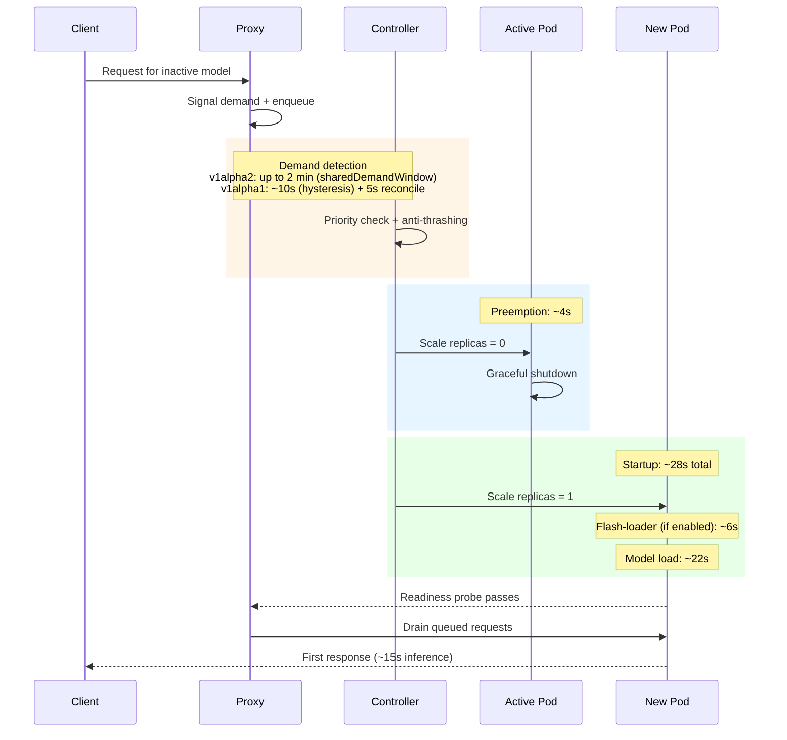

# GPU sharing

FlexInfer supports two GPU-sharing models:

- **v1alpha2**: `Model.spec.gpu.shared` (simple, homelab-friendly)
- **v1alpha1**: `GPUGroup` (explicit policies + anti-thrashing)

## v1alpha2: `spec.gpu.shared`

Models with the same `shared` value compete for the same GPU. Higher priority wins.

```yaml
apiVersion: ai.flexinfer/v1alpha2
kind: Model
metadata:
  name: qwen3-8b
spec:
  backend: mlc-llm
  source: HF://mlc-ai/Qwen3-8B-q4f16_1-MLC
  gpu:
    shared: homelab-gpu
    priority: 100
```

## v1alpha1: `GPUGroup`

`GPUGroup` enables:

- one-active-at-a-time swapping
- anti-thrashing controls
- proxy-driven demand signaling based on real queued requests

See:

- `services/flexinfer/examples/gpugroup-multi-model.yaml`
- `docs/DEPLOYMENT_RUNBOOK.md` (operational notes)

## Practical guidance

- Use `shared`/`GPUGroup` when you have one GPU and multiple “sometimes” models.
- Set priorities to encode “what should win” when demand arrives.
- When possible, combine GPU sharing with caching (`Memory` or `SharedPVC`) to reduce swap latency.

## Swap timing

When a request arrives for an inactive model, the proxy signals demand and the controller orchestrates a swap. The sequence below shows the phases and their typical durations:



### Timing constants

| Parameter | v1alpha2 default | v1alpha1 default | Configurable |
|---|---|---|---|
| Demand window | 2 min | 10s (hysteresis) | v1alpha1: `HysteresisWindowSeconds` |
| Queue threshold | 1 (any demand) | 3 requests | v1alpha1: `RequestQueueThreshold` |
| Swap cooldown | 5 min | 30s | v1alpha1: `MinimumRunDurationSeconds` |
| Preemption cooldown | — | 60s | v1alpha1: `CooldownAfterPreemptionSeconds` |
| Drain timeout | — | 60s | v1alpha1: `DrainTimeoutSeconds` |
| Idle timeout | `spec.serverless.idleTimeout` | 300s | v1alpha1: `IdleTimeoutSeconds` |

### Priority semantics

Higher `priority` values win. A model can only preempt the current active model if its priority is equal to or greater than the active model's priority. Lower-priority models must wait for the active model to go idle.

For v1alpha2 (`spec.gpu.shared`):
- The controller evaluates `demandedPriority >= readyPriority` explicitly in `chooseSharedGroupLeader()`.

For v1alpha1 (`GPUGroup`):
- Priority is encoded in the sort order of `determineActiveModel()`: models with demand are sorted by `priority DESC`, so the highest-priority model with queued requests always wins.

### Reducing swap latency

1. **Flash-loader**: Enable `spec.cache.strategy: Memory` to preload model files from PVC to `/dev/shm` tmpfs via an init container. Saves ~22s of disk I/O on swap.
2. **SharedPVC caching**: Use `spec.cache.strategy: SharedPVC` to keep model files on a persistent volume. Avoids re-downloading on every swap.
3. **Anti-thrashing tuning**: For latency-sensitive workloads, reduce `CooldownAfterPreemptionSeconds` and `MinimumRunDurationSeconds` (v1alpha1) or accept the v1alpha2 defaults.

